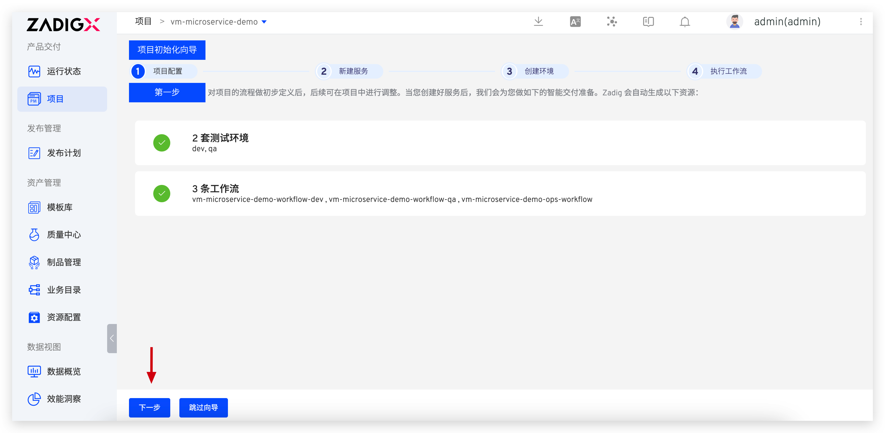

summary: 如何使用现有云主机 + Zadig 自动化交付产品
id: cloudhost
categories: 云主机
environments: Web
status: Published
feedback link: https://github.com/koderover/zadig-bootcamp/issues

# 如何使用现有云主机 + Zadig 自动化交付产品

## 概述

Duration: 0:01:00

本文介绍云主机项目是如何通过 Zadig 快速搭建自动化流程，下面以 Microservice-demo 项目为例，该项目包含 Vue.js 前端服务和 Golang 后端服务。

## 准备工作

Duration: 0:05:00

- [项目案例源码](https://github.com/koderover/zadig/tree/master/examples/microservice-demo) 供您直接使用，该代码仓库主要包含
  - Golang 服务的部署脚本：[https://github.com/koderover/zadig/blob/main/examples/microservice-demo/vm/restart.sh](https://github.com/koderover/zadig/blob/main/examples/microservice-demo/vm/restart.sh)，需事先放在云主机上。
  - 访问的 nginx 配置：[https://github.com/koderover/zadig/blob/main/examples/microservice-demo/frontend/vm/nginx.conf](https://github.com/koderover/zadig/blob/main/examples/microservice-demo/frontend/vm/nginx.conf)，（需确保云主机上安装 nginx，将此文件放在 nginx 配置目录下并使其生效)
- 准备一台云主机，请确保 zadig 系统正常访问。

说明：
1. 请先 fork 以上代码库，然后将在 Zadig 上集成个人代码仓库，详见[文档](https://docs.koderover.com/zadig/settings/codehost/github/)
2. 本教程使用的云主机与 Zadig 系统在同一内网环境，采用云主机的内网地址：ubuntu@172.16.0.23，请根据您的实际主机地址修改。

## 配置主机资源

Duration: 0:03:00

- 登录 Zadig, 进入 `系统设置` -> `主机管理`，点击`新建`。填写对应的主机信息


其中，私钥通过以下方式生成：
1. 在主机上执行以下命令生成 SSH 密钥对。

```bash
ssh-keygen -t rsa -C "your_email@example.com"
```

2. 将生成的公钥追加到 authorized_keys 文件下。

```bash
cat id_rsa.pub >>  authorized_keys
```

3. 将生成的私钥 id_rsa 填入上图`私钥`字段。

Positive 
: 说明：根据产品交付向导完成一个项目初始化配置。


## 产品向导 - 配置项目

Duration: 0:01:00


新建项目，输入项目名称： vm，选择`云主机/物理机`，点击`立即创建`。


进入项目配置页面，点击下一步。




## 产品向导 - 配置服务

Duration: 0:10:00

### 添加 Golang 后端服务。
点击`创建服务`按钮，输入服务名称 backend，添加服务。


配置 backend 服务构建信息。


说明：
  1. 添加构建所需的应用，选择 `go 1.11.5`。
  2. 选择自己账号下的 Zadig 代码仓库。
  3. 填写 backend 服务的构建脚本。

```bash
cp -r zadig/examples/microservice-demo/backend $WORKSPACE/backend
cd $WORKSPACE/backend
make build-backend
tar cvf $PKG_FILE backend
```

资源配置

以 dev 环境为例，选择配置的主机资源 `dev-172.16.0.23`。


如有其它主机资源可自行分配给 qa 环境。

配置部署过程


说明：
  1. 选择 `SSH Agent 远程部署`。
  2. 选择部署脚本执行的主机。
  3. 填写如下部署脚本。

```bash
scp -i $dev_PK $WORKSPACE/backend/$PKG_FILE  $dev_USERNAME@$dev_IP:/cfs/microservice/backend/$PKG_FILE 
ssh -i $dev_PK $dev_USERNAME@$dev_IP 'cd /cfs/microservice/backend && ./restart.sh '$PKG_FILE’' 
```

配置 backend 服务探活，并点击保存。


说明：
1. 协议：backend 服务 使用 HTTP 访问，此处选择 HTTP
2. 路径：backend 服务默认路径为健康检查路径
3. 端口：backend 服务启动端口为 20219

至此，backend 服务已添加完成，下面添加 frontend 服务。

### 添加 Vue.js 前端服务。

点击`创建服务`按钮，输入服务名称 frontend，添加服务。


配置 frontend 服务构建信息。


说明：
  1. 添加构建所需的应用，选择 `node 8.15.0` 和 `yarn 1.3.2`。
  2. 选择自己账号下的 Zadig 代码仓库。
  3. 填写 frontend 服务的构建脚本。

```bash
cd zadig/examples/microservice-demo/frontend
make install-frontend-dep build-frontend
tar cvf $PKG_FILE dist
```


资源配置 

以 dev 环境为例，选择配置的主机资源 `dev-172.16.0.23`。

如有其它主机资源可自行分配给 qa 环境。

配置部署脚本，并点击保存

说明：
  1. 选择 `SSH Agent 远程部署`。
  2. 选择部署脚本执行的主机。
  3. 填写如下部署脚本。

```bash
scp -i $dev_PK $WORKSPACE/zadig/examples/microservice-demo/frontend/$PKG_FILE  $dev_USERNAME@$dev_IP:/cfs/microservice/frontend/$PKG_FILE
ssh -i $dev_PK $dev_USERNAME@$dev_IP 'cd /cfs/microservice/frontend && 'rm -rf dist' && 'tar xvf $PKG_FILE' && 'rm $PKG_FILE''
```

至此，已经成功配置两个服务。

## 产品向导 - 加入运行环境

Duration: 0:01:00

点击向导的「下一步」。这时，Zadig 会根据你的配置，创建两套环境（dev，qa），以及自动化工作流。


点击下一步完成向导。至此，该项目初始化完毕。


## 产品向导 - 运行产品工作流

Duration: 0:01:00

点击「运行」，可以运行工作流任务。


在弹框中选择需要更新的服务，比如：backend 和 frontend。点击「启动任务」。


查看工作流任务运行状况。


进入集成环境，查看 backend 服务的健康状况，绿色表示正常，红色表示服务异常。


## 访问云主机服务

Duration: 0:01:00

更新前访问云主机服务，如下图所示。


执行 vm-workflow-dev 工作流对环境进行更新。

再次访问云主机服务，前后端构建时间已更新，服务已成功更新。


