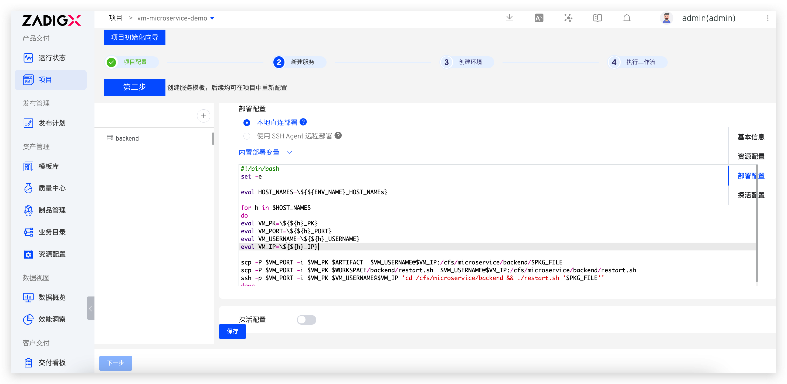
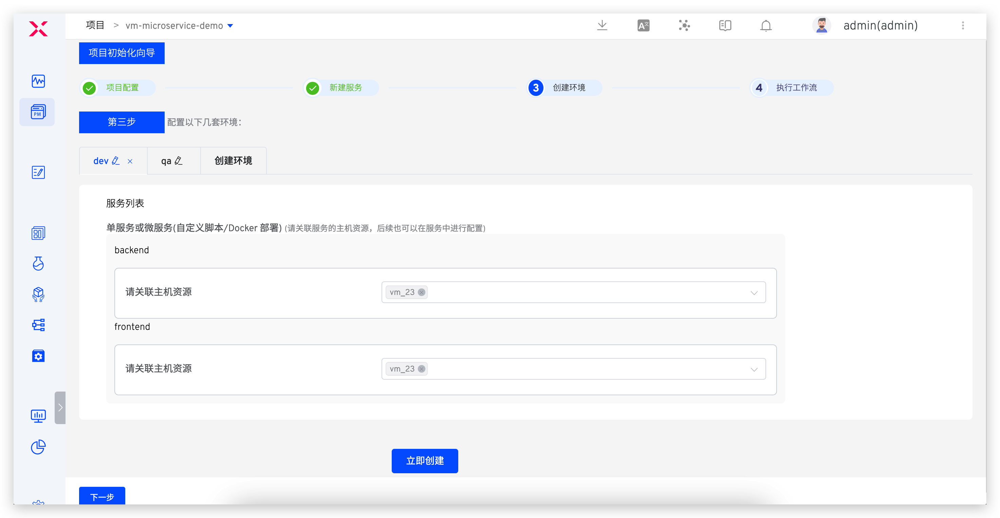

summary: 如何使用现有云主机 + Zadig 自动化交付产品
id: cloudhost
categories: 云主机
environments: Web
status: Published
feedback link: https://github.com/koderover/zadig-bootcamp/issues

# 如何使用现有云主机 + Zadig 自动化交付产品

## 概述

Duration: 0:01:00

本文介绍云主机项目是如何通过 Zadig 快速搭建自动化流程，下面以 Microservice-demo 项目为例，该项目包含 Vue.js 前端服务和 Golang 后端服务。

## 准备工作

Duration: 0:05:00

- 项目案例源码：[项目案例源码](https://github.com/koderover/zadig/tree/master/examples/microservice-demo)，该代码仓库主要包含
  - Golang 服务的部署脚本：[https://github.com/koderover/zadig/blob/main/examples/microservice-demo/vm/restart.sh](https://github.com/koderover/zadig/blob/main/examples/microservice-demo/vm/restart.sh)，需事先放在云主机上。
  - 访问的 nginx 配置：[https://github.com/koderover/zadig/blob/main/examples/microservice-demo/frontend/vm/nginx.conf](https://github.com/koderover/zadig/blob/main/examples/microservice-demo/frontend/vm/nginx.conf)，（需确保云主机上安装 nginx，将此文件放在 nginx 配置目录下并使其生效)
- 准备 Zadig 系统可访问的两台云主机，分别用于部署 dev 环境和 qa 环境。

说明：
1. 请先 fork 以上代码库，然后在 Zadig 上集成个人代码仓库，详见[文档](https://docs.koderover.com/zadig/settings/codehost/github/)
2. 本教程使用的云主机与 Zadig 系统在同一内网环境，用于 dev 环境和 qa 环境的云主机名称分别为 `dev`、`qa`，IP 地址分别为 `172.16.0.23`、`172.16.0.33`，请根据你的实际主机地址修改。
3. 本项目案例实现的主要功能：展示前后端代码的构建时间。

## 配置主机资源

Duration: 0:03:00

- 登录 Zadig, 进入 `系统设置` -> `资源管理` -> `主机管理`，点击`新建`。填写对应的主机信息


其中，私钥通过以下方式生成：

步骤一：在主机上执行以下命令生成 SSH 密钥对。

```bash
ssh-keygen -t rsa -C "your_email@example.com"
```

步骤二：将生成的公钥追加到 ~/.ssh/authorized_keys 文件中。

```bash
cat id_rsa.pub >> ~/.ssh/authorized_keys
```

步骤三：将生成的私钥 id_rsa 填入上图`私钥`字段。

Positive 
: 说明：根据产品交付向导完成一个项目初始化配置。


## 产品向导 - 配置项目

Duration: 0:01:00


新建项目，输入项目名称： vm，选择`云主机/物理机`，点击`立即创建`。


进入项目配置页面，点击`下一步`。


## 产品向导 - 配置服务

Duration: 0:10:00

### 添加 Golang 后端服务。
步骤一： 点击`创建服务`按钮，输入服务名称 backend，添加服务


步骤二： 配置 backend 服务构建信息


说明：
  1. 添加构建所需的应用，选择 `go 1.16.4`。
  2. 选择准备工作中 fork 的 Zadig 代码仓库。
  3. 填写 backend 服务的构建脚本。

```bash
cp -r $WORKSPACE/zadig/examples/microservice-demo/backend $WORKSPACE/backend
cp $WORKSPACE/zadig/examples/microservice-demo/vm/restart.sh $WORKSPACE/backend/restart.sh
cd $WORKSPACE/backend
chmod +x restart.sh
make build-backend
tar cvf $PKG_FILE backend
```

步骤三： 资源配置

分别为 `dev` 环境和 `qa` 环境配置主机资源。


步骤四： 配置部署过程



说明：
  1. 选择 `SSH Agent 远程部署`。
  2. 选择部署脚本执行的主机。
  3. 填写如下部署脚本。

```bash
if [ $ENV_NAME = "dev" ]; then
    AGENT_NAME="dev" # 配置给 dev 环境使用的云主机的名称
elif [ $ENV_NAME = "qa" ]; then
    AGENT_NAME="qa" # 配置给 qa 环境使用的云主机的名称
fi

eval PK=\${${AGENT_NAME}_PK}
eval USERNAME=\${${AGENT_NAME}_USERNAME}
eval IP=\${${AGENT_NAME}_IP}

scp -i $PK $WORKSPACE/backend/$PKG_FILE  $USERNAME@$IP:/cfs/microservice/backend/$PKG_FILE
scp -i $PK $WORKSPACE/backend/restart.sh  $USERNAME@$IP:/cfs/microservice/backend/restart.sh
ssh -i $PK $USERNAME@$IP 'cd /cfs/microservice/backend && ./restart.sh '$PKG_FILE''
```

步骤五(非必须)： 配置 backend 服务探活，并点击保存。


说明：
1. 协议：backend 服务使用 HTTP 访问，此处选择 HTTP
2. 路径：backend 服务默认路径为健康检查路径
3. 端口：backend 服务启动端口为 20219

至此，backend 服务已添加完成，下面添加 frontend 服务。

### 添加 Vue.js 前端服务。

步骤一：点击`创建服务`按钮，输入服务名称 frontend，添加服务


步骤二：配置 frontend 服务构建信息


说明：
  1. 添加构建所需的应用，选择 `node 12.18` 和 `yarn 1.22`。
  2. 选择准备工作中 fork 的 Zadig 代码仓库。
  3. 填写 frontend 服务的构建脚本。

```bash
cd $WORKSPACE/zadig/examples/microservice-demo/frontend
make install-frontend-dep build-frontend
tar cvf $PKG_FILE dist
```

步骤三：资源配置和服务部署

分别为 `dev` 环境和 `qa` 环境配置主机资源，为 frontend 服务配置部署脚本，并保存。


说明：
  1. 为 dev 环境分配主机资源
  2. 为 qa 环境分配主机资源
  3. 部署配置，选择 `SSH Agent 远程部署`
  4. 选择部署脚本执行的主机
  3. 填写如下部署脚本

```bash
if [ $ENV_NAME = "dev" ]; then
    AGENT_NAME="dev" # 配置给 dev 环境使用的云主机的名称
elif [ $ENV_NAME = "qa" ]; then
    AGENT_NAME="qa" # 配置给 qa 环境使用的云主机的名称
fi
eval PK=\${${AGENT_NAME}_PK}
eval USERNAME=\${${AGENT_NAME}_USERNAME}
eval IP=\${${AGENT_NAME}_IP}

scp -i $PK $WORKSPACE/zadig/examples/microservice-demo/frontend/$PKG_FILE  $USERNAME@$IP:/cfs/microservice/frontend/$PKG_FILE
ssh -i $PK $USERNAME@$IP 'cd /cfs/microservice/frontend && 'rm -rf dist' && 'tar xvf $PKG_FILE' && 'rm $PKG_FILE''
```

至此，已经成功配置两个服务。

## 产品向导 - 加入运行环境

Duration: 0:01:00

点击向导的「下一步」。这时，Zadig 会根据你的配置，创建两套环境（dev，qa），以及自动化工作流。



点击下一步完成向导。至此，该项目初始化完毕。


## 产品向导 - 运行产品工作流

Duration: 0:01:00

点击「运行」，可以运行工作流任务。


在弹框中选择需要更新的服务，比如：backend 和 frontend。点击「启动任务」。


查看工作流任务运行状况。


进入集成环境，查看 backend 服务的健康状况，绿色表示正常，红色表示服务异常。


## 对服务进行更新部署

Duration: 0:01:00

访问云主机服务，如下图所示：


进入 `项目` - `vm` - `工作流`，执行 vm-workflow-dev 工作流对 `dev` 环境 frontend 和 backend 服务组件进行更新：


待工作流执行完毕，再次访问云主机服务，如下图所示：


可以看到页面中的前后端构建时间信息已更新，使用工作流更新服务成功。
