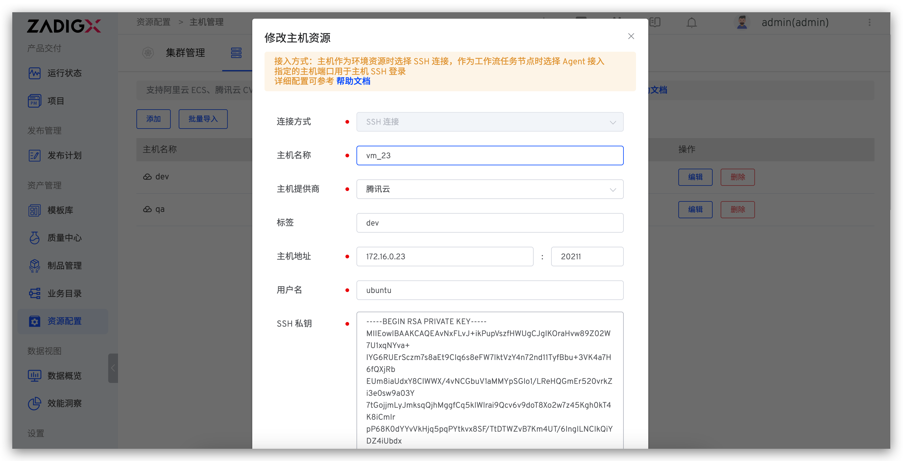
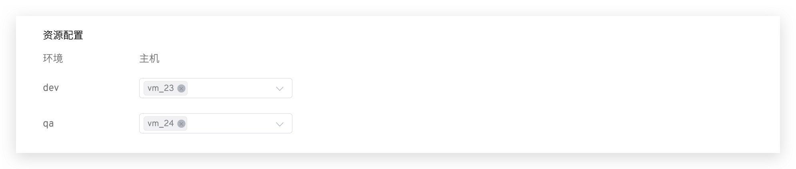
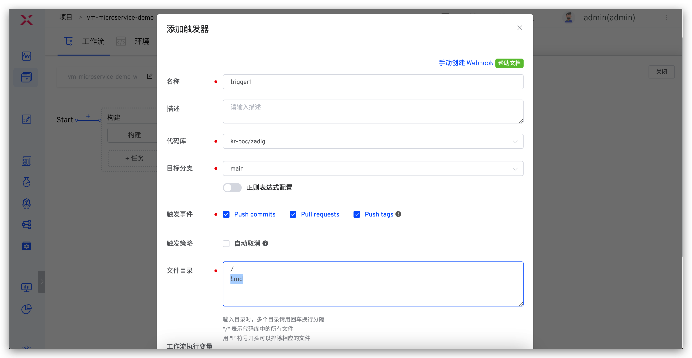
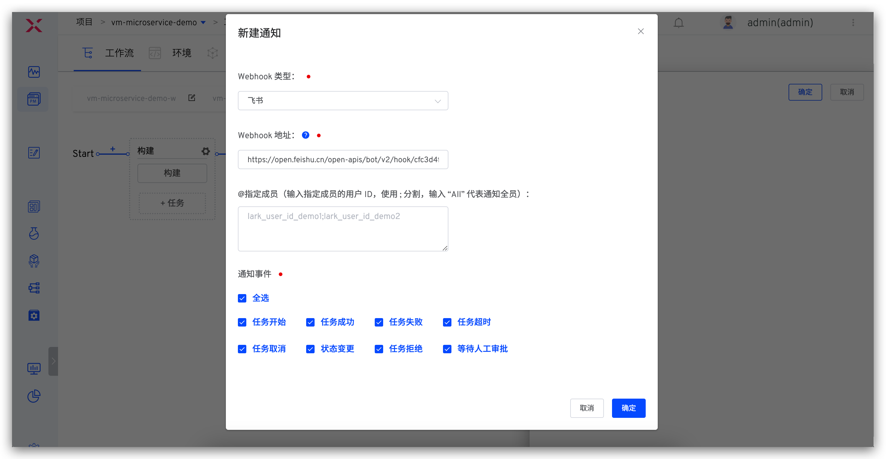
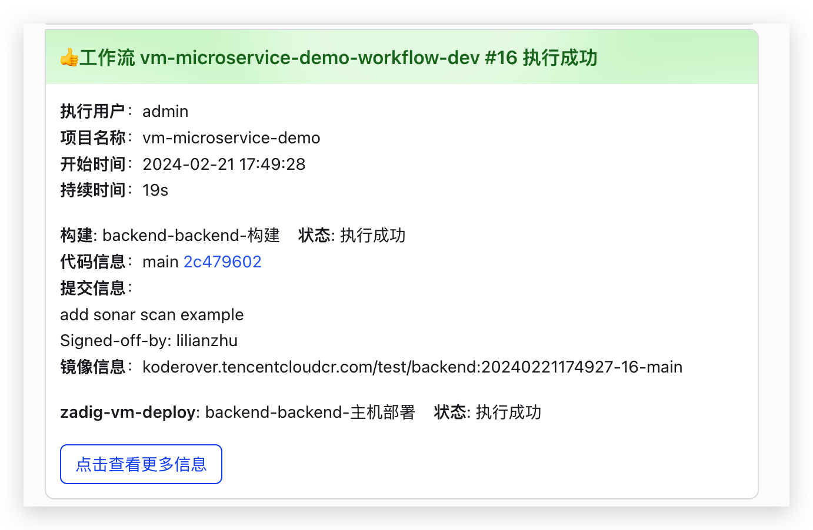

summary: 如何使用现有主机 + Zadig 自动化交付产品
id: cloudhost
categories: 主机
environments: Web
status: Published
feedback link: https://github.com/koderover/zadig-bootcamp/issues

# 如何使用现有主机 + Zadig 自动化交付产品

## 概述

Duration: 0:01:00

本文介绍主机项目是如何通过 Zadig 快速搭建自动化流程，下面以 Microservice-demo 案例为例进行演示，该案例包含 Vue.js 前端服务和 Golang 后端服务，实现的主要功能：分别展示前后端代码的构建时间。

## 准备工作

Duration: 0:05:00

- 本案例所用代码及配置 fork 自[项目案例源码](https://github.com/koderover/zadig/tree/master/examples/microservice-demo)，主要包括：
  - Golang 服务的部署脚本：[https://github.com/koderover/zadig/blob/main/examples/microservice-demo/vm/restart.sh](https://github.com/koderover/zadig/blob/main/examples/microservice-demo/vm/restart.sh)
  - 访问的 nginx 配置：[https://github.com/koderover/zadig/blob/main/examples/microservice-demo/frontend/vm/nginx.conf](https://github.com/koderover/zadig/blob/main/examples/microservice-demo/frontend/vm/nginx.conf)
- 准备 Zadig 系统可访问的两台主机，分别用于部署 dev 环境和 qa 环境，并确保主机上安装 nginx，将上述 [nginx 配置](https://github.com/koderover/zadig/blob/main/examples/microservice-demo/frontend/vm/nginx.conf)放在 nginx 配置目录下并使其生效

## 配置主机资源

Duration: 0:03:00

登录 Zadig，进入`系统设置` -> `主机管理`，点击`新建`，填写主机信息。



参数说明：
- 主机名称：可识别有意义即可，本例中用于部署 dev 环境和 qa 环境的主机名分别为 vm_172、vm_124
- 用户名：登录主机的用户名
- 私钥：可通过以下步骤生成

```bash
# 步骤一：在主机的 $HOME/.ssh 目录下执行以下命令生成 SSH 密钥对
ssh-keygen -t rsa -C "your_email@example.com" 
# 步骤二：将生成的公钥追加到 $HOME/.ssh/authorized_keys 文件中
cat id_rsa.pub >>  authorized_keys
# 步骤三：将生成的私钥 id_rsa 填入上图私钥字段中
```

## 产品向导 - 配置项目

Duration: 0:01:00

进入 Zadig 系统，点击`新建项目` -> 填写项目名称 `vm-microservice-demo` -> 选择`主机项目` -> 点击`立即创建` -> 点击`下一步`。


## 产品向导 - 配置服务

Duration: 0:10:00

### 添加 Golang 后端服务

步骤一：点击 `+` 按钮，输入服务名称 `backend`，添加服务。


步骤二：为 `backend` 服务配置构建、资源、部署和探活

**构建配置**


- 依赖的软件包：选择 `go1.13`
- 代码信息：准备工作中 fork 的 Zadig 代码库
- 在`添加步骤`中选择`二进制包存储路径`，本例中路径为 `$WORKSPACE/backend/$PKG_FILE`
- 通用构建脚本内容如下

```bash
#!/bin/bash
set -ex
env

if [ -e $WORKSPACE/backend ]; then
    rm -rf $WORKSPACE/backend
fi

cp -r $WORKSPACE/zadig/examples/microservice-demo/backend $WORKSPACE/backend
cp $WORKSPACE/zadig/examples/microservice-demo/vm/restart.sh $WORKSPACE/backend/restart.sh
cd $WORKSPACE/backend
chmod +x restart.sh
make build-backend
tar cvf $PKG_FILE backend
```

**资源配置**

分别为 `dev` 环境和 `qa` 环境配置主机资源。



- dev 环境：本例中使用主机 vm_172 进行 dev 环境的部署
- qa 环境：本例中使用主机 vm_124 进行 qa 环境的部署

**部署配置**


- 选择 SSH Agent 远程部署，并选择 SSH Agent 主机
- 部署脚本如下

```bash
#!/bin/bash
set -ex

env

if [ $ENV_NAME = "dev" ]; then
    VM_NAME="vm_172" # 配置给 dev 环境使用的云主机的名称
elif [ $ENV_NAME = "qa" ]; then
    VM_NAME="vm_124" # 配置给 qa 环境使用的云主机的名称
fi

AGENT_NAME="vm_172"

eval AGENT_PK=\${${AGENT_NAME}_PK}
eval AGENT_PORT=\${${AGENT_NAME}_PORT}
eval VM_USERNAME=\${${VM_NAME}_USERNAME}
eval VM_IP=\${${VM_NAME}_IP}

scp -P $AGENT_PORT -i $AGENT_PK $ARTIFACT  $VM_USERNAME@$VM_IP:/cfs/microservice/backend/$PKG_FILE
scp -P $AGENT_PORT -i $AGENT_PK $WORKSPACE/backend/restart.sh  $VM_USERNAME@$VM_IP:/cfs/microservice/backend/restart.sh
ssh -p $AGENT_PORT -i $AGENT_PK $VM_USERNAME@$VM_IP 'cd /cfs/microservice/backend && ./restart.sh '$PKG_FILE''
```

**探活配置**


- 协议：选择 TCP
- 端口：配置 20219
- 响应超时：配置 2(秒)

填写完毕后，点击`保存`按钮完成 `backend` 服务的配置。

### 添加 Vue.js 前端服务

点击 `+` 按钮继续新建 `frontend` 服务并完成构建、资源、部署配置。

**构建配置**


- 依赖的软件包：选择 `yarn 1.15.2` 和 `node 8.15.0`
- 代码信息：准备工作中 fork 的 Zadig 代码库
- 在`添加步骤`中选择`二进制包存储路径`，本例中路径为 `$WORKSPACE/zadig/examples/microservice-demo/frontend/$PKG_FILE`
- 通用构建脚本内容如下

```bash
#!/bin/bash
set -ex

cd $WORKSPACE/zadig/examples/microservice-demo/frontend
make install-frontend-dep build-frontend
tar cvf $PKG_FILE dist
```

**资源配置**

同 `backend` 服务，此处不再赘述。


**部署配置**


- 使用 SSH Agent 远程部署并选择 SSH Agent 主机
- 部署脚本如下

```bash
#!/bin/bash
set -ex

if [ $ENV_NAME = "dev" ]; then
    VM_NAME="vm_172" # 配置给 dev 环境使用的云主机的名称
elif [ $ENV_NAME = "qa" ]; then
    VM_NAME="vm_172" # 配置给 qa 环境使用的云主机的名称
fi

AGENT_NAME="vm_172"
eval AGENT_PK=\${${AGENT_NAME}_PK}
eval AGENT_PORT=\${${AGENT_NAME}_PORT}
eval VM_USERNAME=\${${VM_NAME}_USERNAME}
eval VM_IP=\${${VM_NAME}_IP}

scp -P $AGENT_PORT -i $AGENT_PK $ARTIFACT $VM_USERNAME@$VM_IP:/cfs/microservice/frontend/$PKG_FILE
ssh -p $AGENT_PORT -i $AGENT_PK $VM_USERNAME@$VM_IP 'cd /cfs/microservice/frontend && 'rm -rf dist' && 'tar xvf $PKG_FILE' && 'rm $PKG_FILE''
```

填写完毕后，点击`保存`按钮完成 `frontend` 服务的配置。

## 产品向导 - 加入运行环境

Duration: 0:01:00

点击向导的`下一步`，这时，Zadig 会根据你的配置，创建两套环境以及自动化工作流。继续点击`下一步` -> `完成`结束项目向导。


## 产品向导 - 运行产品工作流

Duration: 0:01:00

选择 `vm-microservice-demo-workflow-dev` 工作流 -> 点击`执行` -> 选择服务，对 dev 环境的服务进行更新。

点击「运行」，可以运行工作流任务。


触发工作流后，可查看工作流运行状况，点击服务左侧的展开图标可查看服务构建的实时日志。


待工作流运行完毕，进入环境查看服务状态，可看到配置了探活检测的 backend 服务已正常运行。


访问服务，可看到前后端构建时间也在服务中体现出来。

Negative
: 服务的访问地址和 nginx 的具体配置以及域名解析有关，请视实际情况访问


## 产品向导 - 自动触发工作流

Duration: 0:02:00

添加触发器，使得代码 Push commit、Pull Request、Push tag 都能自动触发部署服务。

- 配置工作流 `vm-microservice-demo-workflow-dev`


- 添加触发器配置 -> 打开 Webhook 开关 -> 添加配置 -> 填写配置 -> 保存配置 -> 保存对工作流的修改



- 以 `Pull Request` 事件为例，提交代码变更后，会有触发工作流的信息。可点击右侧 `Details` 链接快速跳转到触发的工作流


- 访问服务，可看到前后端构建时间均已修改


## 产品向导 - IM 通知

Duration: 0:01:00

配置工作流 -> 参考 [IM 通知](https://docs.koderover.com/zadig/v1.11.0/project/workflow/#im-%e7%8a%b6%e6%80%81%e9%80%9a%e7%9f%a5)填写相关配置 -> 保存修改。



工作流执行后，会自动将运行结果和环境、服务等信息推送到 IM 系统中，方便及时跟进。


