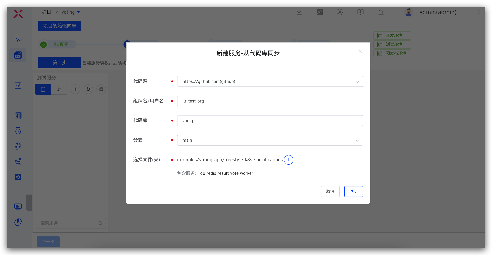
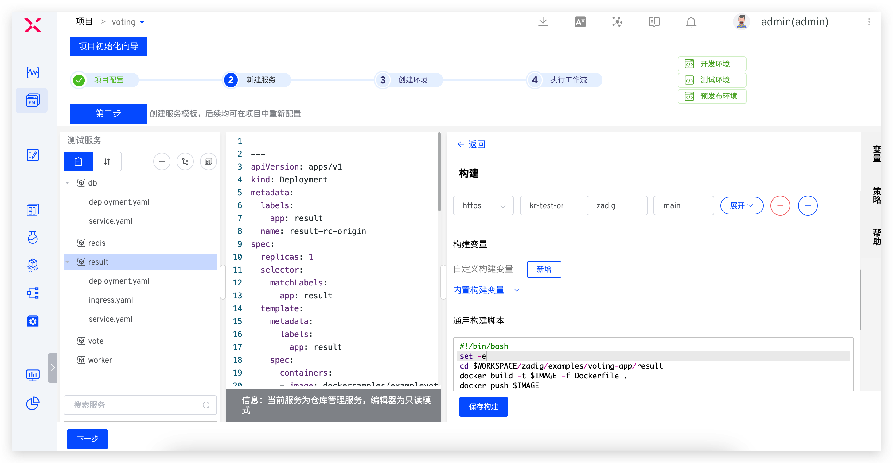
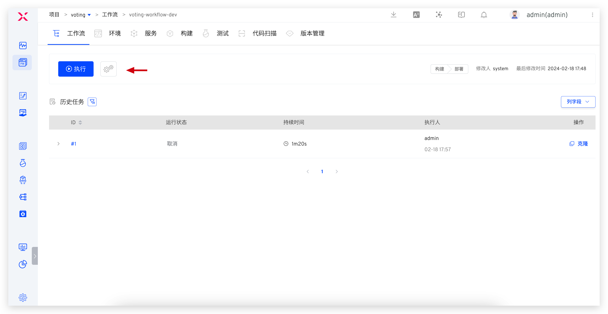
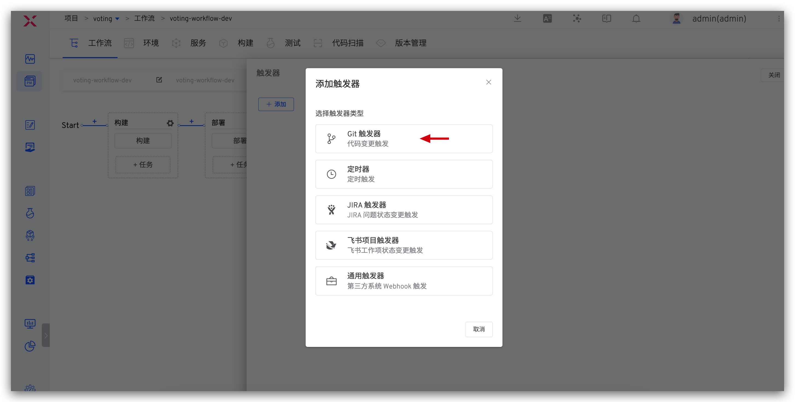

summary: 如何使用 GitHub + Zadig 实现产品级持续交付
id: GitHub
categories: GitHub
environments: Web
status: Published
feedback link: https://github.com/koderover/zadig-bootcamp/issues

# 如何使用 GitHub + Zadig 实现产品级持续交付

## 概述

Duration: 0:01:00

本文介绍 GitHub 仓库管理的项目如何在 Zadig 上快速搭建，下面以 Voting 项目为例，该项目包含 Python, Redis, Postgres, Node.js, and .Net 等相对典型的微服务应用程序组合。以下步骤包含从 Code 到 Ship 的整个过程的演示。


## 准备工作

Duration: 0:02:00

本案例所用代码及配置 fork 自 [项目案例源码](https://github.com/koderover/zadig/tree/main/examples/voting-app)，主要包含：
- 案例中 5 个服务的 Kubernetes YAML 配置：[`YAML`](https://github.com/koderover/zadig/tree/main/examples/voting-app/freestyle-k8s-specifications)
- 案例中 3 个业务服务的 Dockerfile 文件：[`result`](https://github.com/koderover/zadig/tree/main/examples/voting-app/result/Dockerfile)、[`vote`](https://github.com/koderover/zadig/tree/main/examples/voting-app/vote/Dockerfile)、[`worker`](https://github.com/koderover/zadig/tree/main/examples/voting-app/worker/Dockerfile)

案例中使用的 Ingress 对 K8s 集群版本有要求（1.19 及以上），请确保 K8s 集群版本在 1.19 及以上，并根据自己的域名及解析情况按需修改 [`result`](https://github.com/koderover/zadig/blob/main/examples/voting-app/freestyle-k8s-specifications/result/result-service.yaml#L25) 服务和 [`vote`](https://github.com/koderover/zadig/blob/main/examples/voting-app/freestyle-k8s-specifications/vote/vote-service.yaml#L25) 服务的规则。

Positive
: 如果你的 K8s 集群版本在 [1.9, 1.19) 区间内，可以使用 [此处](https://github.com/koderover/zadig/tree/release-1.13.0/examples/voting-app) 的源码来实践本教程。

## 接入 GitHub 代码源

Duration: 0:05:00

### 新建 GitHub OAuth 应用程序

1. 个人账号下的代码库接入：
可以通过点击用户名 -> `Settings` -> `Developer settings` -> `OAuth Apps` 来新建应用程序。

2. GitHub Organization 下的代码仓库接入：
可以通过点击 `Organization Settings` -> `Developer settings` -> `OAuth Apps` 来新建应用程序。

下面以 GitHub Organization 为例，如下所示。

- 打开 `Organization Settings`。


- 选择 `Developer settings` -> `OAuth Apps`，点击 `New OAuth App` 新建应用程序。


### 配置 GitHub OAuth 应用程序


在新建应用程序页面，你需要进行如下步骤：

- Application name：zadig，也可以填写可识别的任一名称。
- Homepage URL：http://[koderover.yours.com]
- Authorization callback URL： `http://[koderover.yours.com]/api/directory/codehosts/callback`
- 点击注册

### 获取 Client ID、Client Secret 信息

应用创建成功后，GitHub 会返回应用的基本信息，点击 `Generate a new client secret` 生成 `Client Secret`。


此时页面包括完整的 `Client ID` 、`Client Secret`。


### 将 Client ID、Client Secret 集成到系统

切换到 Zadig 系统，管理员依次点击`系统设置` -> `集成管理` -> `代码源` -> 点击添加按钮。


依次填入如下已知信息：

- `代码源`：此处选择 GitHub
- `代码源标识`：自定义
- `Client ID`：应用的 Client ID
- `Client Secret`：应用生成的 Client Secret

信息确认无误后点击 `前往授权`，耐心等待，此时会系统会跳转到 GitHub 进行授权。


点击授权按钮，同意授权后，GitHub 会跳转到 Zadig 系统，至此 GitHub 集成完毕。

## 项目配置

Duration: 0:01:00

进入 Zadig 系统，点击`新建项目` -> 填写项目名称 `voting` -> 选择 `K8s YAML 项目` -> 点击立即创建。


## 新建服务并配置构建

Duration: 0:03:00

### 新建服务

这里我们需要为以下 5 个服务添加服务配置：

* vote
* worker
* result
* redis
* db

并为以下三个业务服务添加构建以支持持续交付：

* vote
* worker
* result

Negative
: 服务配置指的是 YAML 对这个服务的定义，Kubernetes 可以根据这个定义产生出服务实例。可以理解为 Service as Code。

Zadig 提供三种方式管理服务配置：

* 手工输入：在创建服务时手动输入服务的 K8s YAML 配置文件，内容存储在 Zadig 系统中。
* 从代码库同步：服务的 K8s YAML 配置文件在代码库中，从代码库中同步服务配置。之后提交到该代码库的 YAML 变更会被自动同步到 Zadig 系统上。
* 使用模板新建：在 Zadig 平台中创建服务 K8s YAML 模板，创建服务时，在模板的基础上对服务进行重新定义。

这里，我们使用从代码库同步的方式。点击`从代码库同步`按钮 -> 选择仓库信息 -> 选择文件目录 `examples`->`voting-app`->`freestyle-k8s-specifications` -> 点击`同步`按钮即可。




### 配置构建

接下来为服务配置构建，以便于后续对服务进行持续交付，具体操作步骤：选择具体的服务 -> 点击`添加构建` -> 填写代码信息和构建脚本。




以 `vote` 服务为例，在构建脚本中填写以下代码：

```bash
cd $WORKSPACE/zadig/examples/voting-app/<service-directory>
docker build -t $IMAGE -f Dockerfile .
docker push $IMAGE
```

重复以上配置服务构建过程，完成 `vote`、`worker` 和 `result` 的构建配置，注意根据不同的服务修改脚本中的 `&lt;service-directory&gt;`参数。

## 创建环境

Duration: 0:01:00

- 点击向导的「下一步」。这时，Zadig 会根据你的配置，创建两套包括上述 5 个服务的环境以及相关工作流，可自定义环境和服务，如下图所示。


- 点击创建环境，完成后继续点击下一步。

## 工作流交付

Duration: 0:01:00

使用工作流对环境中的服务进行部署更新，以 `dev` 环境为例操作步骤如下。

- 点击 `voting-workflow-dev` 工作流 -> 选择需要更新的服务（比如 `vote` 和 `result`），点击「执行」运行工作流。


- 触发工作流后，可查看工作流运行状况，点击构建详情查看服务构建实时日志。


- 待工作流运行完毕，进入 `dev` 环境，可看到 `vote` 服务和 `result` 服务被部署更新成功，镜像信息均被更新。


- 点击 `result` 和 `vote` 暴露出来的 URL 可以查看网站。

Negative
: 需要注意此处的 URL 正常访问依赖于服务的 Ingress 配置，需要在准备工作中根据自己的域名及解析情况按需修改。


`vote` 页面：


`result` 页面：


## 配置自动触发工作流

Duration: 0:02:00

添加触发器，使得代码 Push commit、Pull Request、Push tag 都能自动触发 result、vote 服务的重新构建和部署。

- 配置工作流



- 添加触发器 -> 选择 Git 触发器 -> 添加配置 -> 填写配置




## 改动代码，触发工作流

Duration: 0:02:00

- 提交 GitHub PR 修改源代码，交换 `vote` 服务中 `CATS` 和 `DOGS` 的背景颜色。


- 在 GitHub 的 PR 页面中，会有触发工作流的信息。可点击 `Details` 链接快速跳转到触发的工作流


- 待工作流执行完毕，进入 `项目`->`voting`->`集成环境`，点击 `dev` 环境中 `vote` 服务的服务入口，查看网站结果，可以看见 `CATS` 和 `DOGS` 背景栏颜色已被更改。

 

## 配置 IM 通知

Duration: 0:02:00

- 配置工作流


- 添加通知 -> 参考 [IM 通知](https://docs.koderover.com/zadig/workflow/im/)填写相关配置 -> 保存修改


- 工作流执行后，会自动将运行结果和环境、服务等信息推送到 IM 系统中，方便及时跟进


