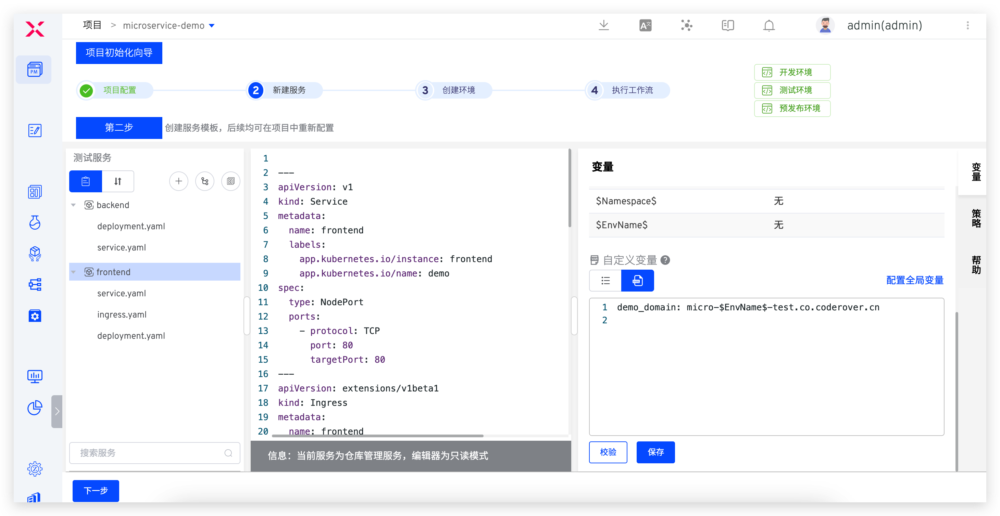
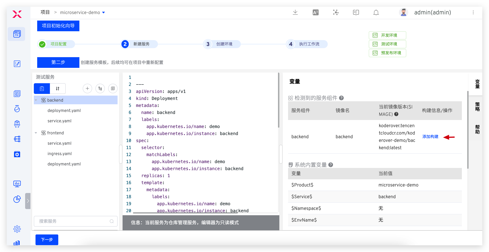
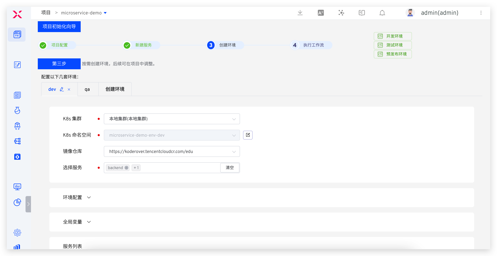
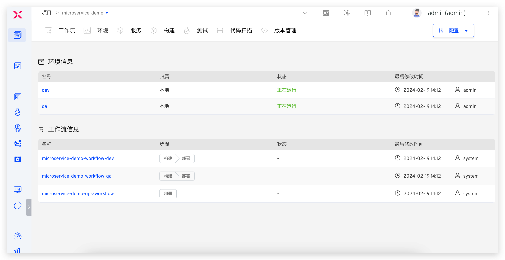

summary: 如何使用 GitLab + Zadig 实现产品级持续交付
id: GitLab
categories: GitLab
environments: Web
status: Published
feedback link: https://github.com/koderover/zadig-bootcamp/issues

# 如何使用 GitLab + Zadig 实现产品级持续交付

## 概述

Duration: 0:01:00

本文介绍 GitLab 仓库管理的项目如何在 Zadig 上快速搭建，下面以 microservice-demo 项目为例，该项目包含 Vue.js 前端服务和 Golang 后端服务，以下步骤包含从 Code 到 Ship 的整个过程的演示。


## 准备工作

Duration: 0:02:00

[项目案例源码](https://github.com/koderover/zadig/tree/master/examples/microservice-demo) 供您直接使用，该代码仓库主要包含：

  - 服务 YAML 文件： [`https://github.com/koderover/zadig/tree/main/examples/microservice-demo/k8s-yaml`](https://github.com/koderover/zadig/tree/main/examples/microservice-demo/k8s-yaml)
  - 服务 Dockerfile 文件：
    - Frontend Dockerfile：[`https://github.com/koderover/zadig/blob/main/examples/microservice-demo/frontend/Dockerfile`](https://github.com/koderover/zadig/blob/main/examples/microservice-demo/frontend/Dockerfile)
    - Backend Dockerfile：[`https://github.com/koderover/zadig/blob/main/examples/microservice-demo/backend/Dockerfile`](https://github.com/koderover/zadig/blob/main/examples/microservice-demo/backend/Dockerfile)

在自己的 GitLab 上创建名为 `microservice-demo` 的代码仓库，并将[源码](https://github.com/koderover/zadig/tree/master/examples/microservice-demo)放到 `microservice-demo` 仓库中。

Positive
: 只需要将 microservice-demo 目录下的内容放在 microservice-demo 库中即可，无需在 GitLab 上准备整个 zadig 仓库。

目前系统内置的 Golang 版本无法满足本例中后端服务的构建诉求，管理员可通过在`系统设置` -> `软件包管理`中添加新的 Golang 版本，以 `go 1.16.13` 为例说明如下。

- `名称`：go
- `版本`：1.16.13
- `Bin Path`：$HOME/go/bin
- `启用`：开启`启用该软件包`
- `安装包地址`：https://go.dev/dl/go1.16.13.linux-amd64.tar.gz
- `安装脚本`：tar -C $HOME -xzf ${FILEPATH}


## 接入 GitLab 代码源

Duration: 0:05:00

### 新建 GitLab OAuth 应用程序

GitLab 管理者可以通过 `Admin Area` > `Applications` 来新建应用程序。


### 配置 GitLab OAuth 应用程序

在新建应用程序页面，需要进行以下操作
- 填写应用的名称
- 回调地址请填写  `http://[zadig.yours.com]/api/directory/codehosts/callback`
- 赋予权限 `api` 、`read_user` 、`read_repository`
- 点击创建


Positive
: 回调地址中 `zadig.yours.com` 需要替换为 Zadig 系统部署的实际地址

### 获取 Application ID、Secret 信息

应用创建成功后，GitLab 会返回应用的相关信息，其中包括 `Application ID` 、`Secret` 信息。


### 将 Application ID、Secret 集成到系统

切换到 Zadig 系统，管理员依次点击 `系统设置` -> `集成管理` -> `代码源集成` -> 点击添加按钮。


依次填入如下已知信息：
- `代码源`：此处选择 GitLab
- `GitLab 服务 URL`：GitLab 地址
- `Application ID`：应用创建成功后返回的 Application ID
- `Secret`：应用创建成功后返回的 Secret
信息确认无误后点击 `前往授权`，耐心等待，此时会系统会跳转到 GitLab 进行授权。


点击授权按钮，同意授权后，GitLab 会跳转到 Zadig 系统，至此 GitLab 集成完毕。

## 项目配置

Duration: 0:01:00

进入 Zadig 系统，点击`新建项目` -> 填写项目名称 `microservice-demo` -> 选择 `K8s YAML 项目` -> 点击`立即创建` -> 点击`下一步`。


## 新建服务并配置构建

Duration: 0:05:00

### 新建服务

Negative
: 服务配置指的是 YAML 对这个服务的定义，Kubernetes 可以根据这个定义产生出服务实例。可以理解为 Service as Code。

Zadig 提供三种方式管理服务配置：

* 手工输入：在创建服务时手动输入服务的 K8s YAML 配置文件，内容存储在 Zadig 系统中。
* 从代码库同步：服务的 K8s YAML 配置文件在代码库中，从代码库中同步服务配置。之后提交到该代码库的 YAML 变更会被自动同步到 Zadig 系统上。
* 使用模板新建：在 Zadig 平台中创建服务 K8s YAML 模板，创建服务时，在模板的基础上对服务进行重新定义。

这里，我们使用从代码库同步的方式：点击`从代码库同步`按钮 -> 选择仓库信息 -> 选择文件目录 `k8s-yaml` -> 点击`同步`按钮即可。


加载服务配置后，设置配置中的自定义变量 `demo_domain` 值为 `micro-$EnvName$-test.co.coderover.cn`。此处使用系统内置变量 `$EnvName$` 来为域名赋值，当环境创建完毕后，不同环境中的服务将会有不同的访问地址。

Positive
: 请根据自己的域名及解析情况按需填写此处 `demo_domain` 的值



### 配置构建

配置后端服务构建：选择 `backend` 服务 -> 点击`添加构建` -> 填写构建配置和构建脚本后保存。




构建配置说明：
1. 应用列表选择 `go 1.16.13`
2. 代码信息，选择 `microservice-demo` 所在的代码仓库
3. 构建脚本如下：

```bash
cd microservice-demo/backend
make build-backend
docker build -t $IMAGE -f Dockerfile .
docker push $IMAGE
```

同样的步骤为 `frontend` 服务配置构建并保存。


构建配置说明：
1. 代码信息，选择 `microservice-demo` 所在的代码仓库
2. 构建脚本如下：

```bash
cd microservice-demo/frontend
docker build -t $IMAGE -f Dockerfile .
docker push $IMAGE
```

## 加入环境

Duration: 0:01:00

- 点击向导的「下一步」。这时，Zadig 会根据你的配置，创建两套包括上述 2 个服务的环境以及相关工作流，如下图所示。



- 继续点击下一步完成向导流程。


- 点击完成向导，一个有 2 个微服务的项目、2 套环境、3 条工作流已经产生，项目概览如下。



## 工作流交付

Duration: 0:01:00

使用工作流对环境中的服务进行部署更新，以 `dev` 环境为例操作步骤如下。

- 点击 `microservice-demo-workflow-dev` 工作流 -> 选择服务，点击「启动任务」运行工作流。


- 触发工作流后，可查看工作流运行状况，点击服务左侧的展开图标可查看服务构建的实时日志。


- 待工作流运行完毕，进入 `dev` 环境，可看到 `backend` 服务和 `frontend` 服务被部署更新成功，镜像信息均被更新。


## 配置自动触发工作流

Duration: 0:02:00

添加触发器，使得代码 Push commit、Pull Request、Push tag 都能自动触发服务的重新构建和部署。

- 配置工作流


- 添加 Webhook 触发器 -> 打开 Webhook 开关 -> 添加配置 -> 填写配置


- 保存对工作流的修改


## 改动代码，触发工作流

Duration: 0:02:00

- 提交 GitLab PR 修改源代码。在 PR 页面中会有触发工作流的信息，可点击工作流链接快速跳转到触发的工作流


- 待工作流执行完毕，进入 `项目`->`voting`->`环境`，可看到服务的镜像已被自动触发的工作流更新。

 

## 配置 IM 通知

Duration: 0:02:00

- 配置工作流


- 添加通知 -> 参考 [IM 通知](https://docs.koderover.com/zadig/v1.11.0/project/workflow/#im-%E7%8A%B6%E6%80%81%E9%80%9A%E7%9F%A5)填写相关配置 -> 保存修改


- 工作流执行后，会自动将运行结果和环境、服务等信息推送到 IM 系统中，方便及时跟进


