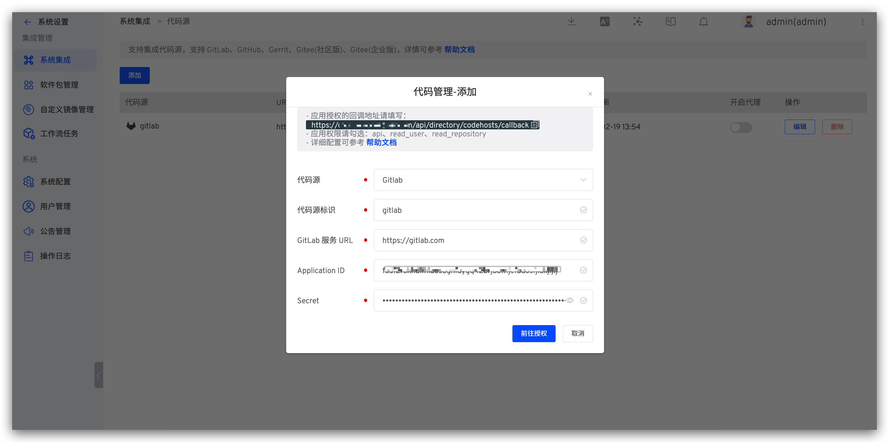

summary: 如何使用 GitLab + Zadig 实现产品级持续交付
id: GitLab
categories: GitLab
environments: Web
status: Published
feedback link: https://github.com/koderover/zadig-bootcamp/issues

# 如何使用 GitLab + Zadig 实现产品级持续交付

## 概述

Duration: 0:01:00

本文介绍 GitLab 仓库管理的项目如何在 Zadig 上快速搭建，下面以 Microservice-demo 项目为例，该项目包含 Vue.js 前端服务和 Golang 后端服务，以下步骤包含从 Code 到 Ship 的整个过程的演示。

## 准备工作

Duration: 0:02:00

[项目案例源码](https://github.com/koderover/Zadig/tree/master/examples/micorservice-demo) 供您直接使用，该代码仓库主要包含：

  - 服务 Yaml 文件： [`https://github.com/koderover/Zadig/tree/main/examples/microservice-demo/k8s-yaml`](https://github.com/koderover/Zadig/tree/main/examples/microservice-demo/k8s-yaml)
  - 服务 Dockerfile 文件：
    - Frontend Dockerfile：[`https://github.com/koderover/Zadig/blob/main/examples/microservice-demo/frontend/Dockerfile`](https://github.com/koderover/Zadig/blob/main/examples/microservice-demo/frontend/Dockerfile)
    - Backend Dockerfile：[`https://github.com/koderover/Zadig/blob/main/examples/microservice-demo/backend/Dockerfile`](https://github.com/koderover/Zadig/blob/main/examples/microservice-demo/backend/Dockerfile)

Positive
: 建议把源码放到自己的 GitLab 代码仓库后再进行下面的操作。

## 接入 GitLab 代码源

Duration: 0:05:00

### 新建 GitLab OAuth 应用程序

GitLab 管理者可以通过 `Admin Area` > `Applications` 来新建应用程序。


### 配置 GitLab OAuth 应用程序

在新建应用程序页面，需要进行以下操作
- 填写应用的名称
- 回调地址请填写  `http://[zadig.yours.com]/api/directory/codehosts/callback`
- 赋予权限 `api` 、`read_user` 、`read_repository`
- 点击创建


Positive
: 回调地址中 `zadig.yours.com` 需要替换为 Zadig 系统部署的实际地址

### 获取 Application ID、Secret 信息

应用创建成功后，GitLab 会返回应用的相关信息，其中包括 `Application ID` 、`Secret` 信息。


### 将 Application ID、Secret 集成到系统

切换到 Zadig 系统，管理员依次点击 `系统设置` -> `集成管理` -> `代码源集成` -> 点击添加按钮。



依次填入如下已知信息：
- `代码源`：此处选择 GitLab
- `GitLab 服务 URL`：GitLab 地址
- `Application ID`：应用创建成功后返回的 Application ID
- `Secret`：应用创建成功后返回的 Secret
信息确认无误后点击 `前往授权`，耐心等待，此时会系统会跳转到 GitLab 进行授权。


点击授权按钮，同意授权后，GitLab 会跳转到 Zadig 系统，至此 GitLab 集成完毕。

## 项目配置

Duration: 0:01:00

进入 Zadig 系统：


新建项目，项目名为`microservice-demo`：


## 创建服务与服务构建

Duration: 0:05:00

Zadig 提供 2 种方式管理这些模板：
- 系统平台管理：在 Zadig 中直接输入 Yaml 。
- 代码仓导入与同步：从某个 Git 仓中导入，之后提交到代码仓的 Yaml 变更会自动同步到 Zadig 系统上。

Positive
: 服务 Yaml 自动同步到 Zadig 系统上的功能会在配置 [Webhook](https://docs.koderover.com/zadig/settings/webhook-config/#gitlab-webhook-%E9%85%8D%E7%BD%AE) 后生效

这里，我们使用代码仓导入的方式。 文件目录中准备好了这些 Yaml 。现在要做的就是把 backend 和 frontend K8s Yaml 依次导入。

加载服务配置：点击`仓库托管` 按钮 -> 选择仓库信息 -> 选择文件目录。导入成功后，设置自定义变量 `demo_domain` 值，引用 系统内置变量`$EnvName$`，来区分不同的环境域名。


配置后端服务构建：选择`backend`服务 -> 点击`添加构建` -> 填写构建脚本。


构建配置说明：
1. 应用列表选择 `go 1.16.4`
2. 代码信息，选择 `microservice-demo` 所在的代码仓库
3. 构建脚本如下：

```bash
cd microservice-demo/backend
make build-backend
docker build -t $IMAGE -f Dockerfile .
docker push $IMAGE
```

4. 保存构建配置
配置前端服务构建：选择`frontend`服务 -> 点击`添加构建` -> 填写构建脚本。


构建配置说明：
1. 代码信息，选择 `microservice-demo` 所在的代码仓库
2. 构建脚本如下：

```bash
cd microservice-demo/frontend
docker build -t $IMAGE -f Dockerfile .
docker push $IMAGE
```

3. 保存构建配置

## 加入运行环境

Duration: 0:01:00

点击向导的「下一步」。这时，Zadig 会根据你的配置，创建 2 套环境（dev，qa），以及相关工作流。


点击下一步完成向导。至此，Onboarding 完成。根据配置，已经产生 2 套环境和 3 条工作流。


## 工作流交付

Duration: 0:01:00

点击「运行」，可以运行工作流：


选择需要更新的服务 `backend` 和 `frontend`，点击「启动」运行工作流：


查看工作流运行状况：


进入集成环境，查看服务列表，并点击服务 URL，可以查看网站。


## 配置自动触发工作流

Duration: 0:03:00

Positive
: 前提条件：配置 GitLab 的 Webhook，Webhook 配置请参考 [GitLab Webhook](https://docs.koderover.com/zadig/settings/webhook-config/#gitlab-webhook-%E9%85%8D%E7%BD%AE)

添加触发器，使得代码 Push 或者 Pull Request 都触发 `backend` 和 `frontend` 重新构建和部署。

进入工作流配置页面：


添加 Webhook 触发器：


配置 Webhook 触发器

1. backend 服务触发器配置：


如上图所示，当 backend 文件夹中的代码变动时会触发 `backend` 服务的更新

2. frontend 服务触发器配置：


如上图所示，当 frontend 文件夹中的代码变动时会触发 `frontend` 服务的更新


保存工作流：


## 改动代码，触发工作流

Duration: 0:03:00

改动前端代码：


查看工作流运行情况：


查看网站运行结果：


