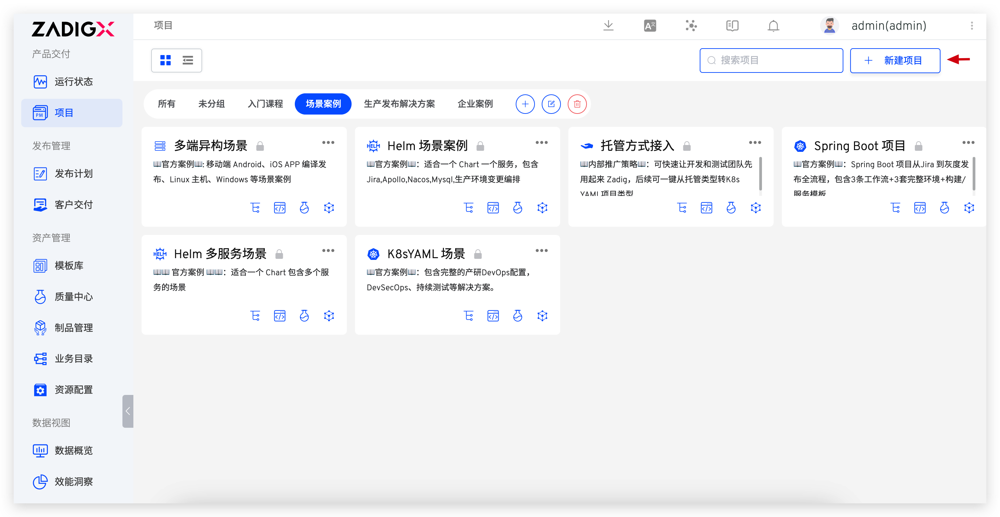
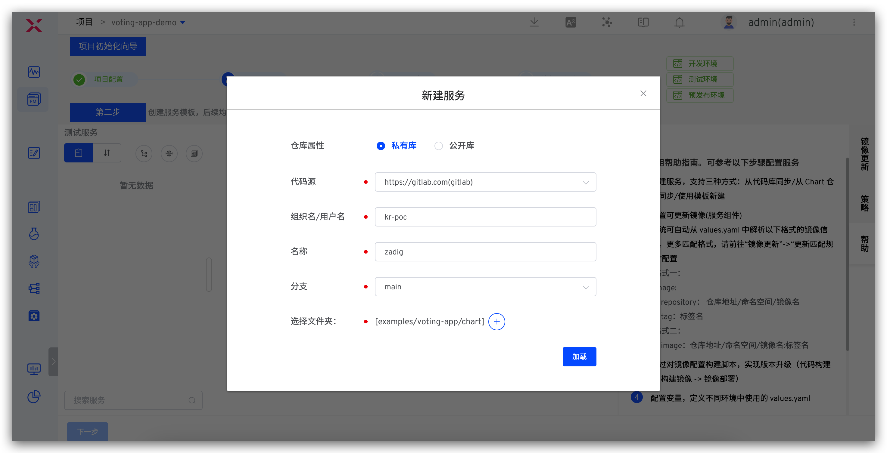
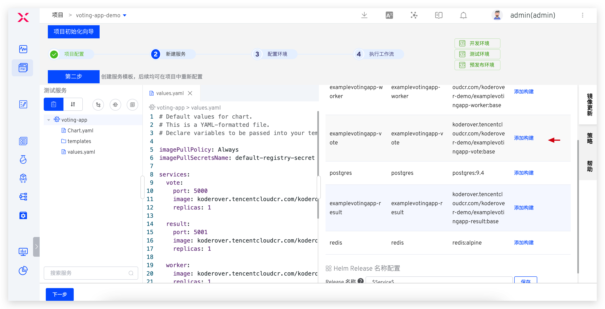
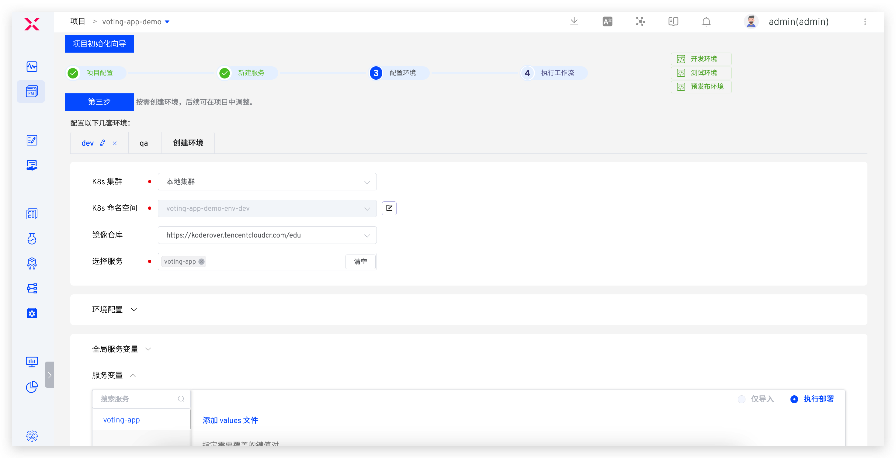
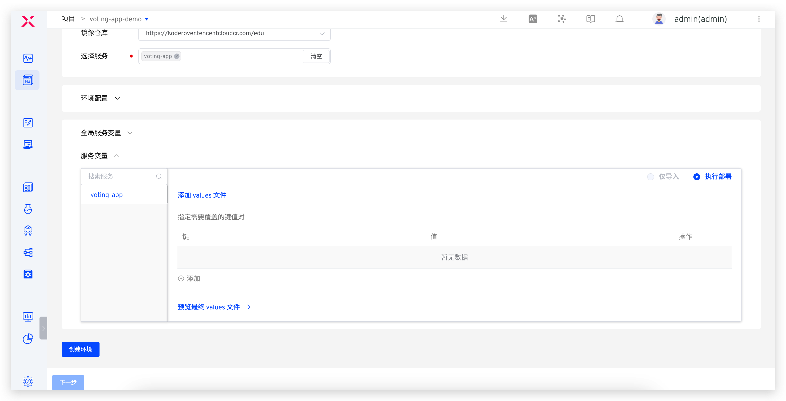
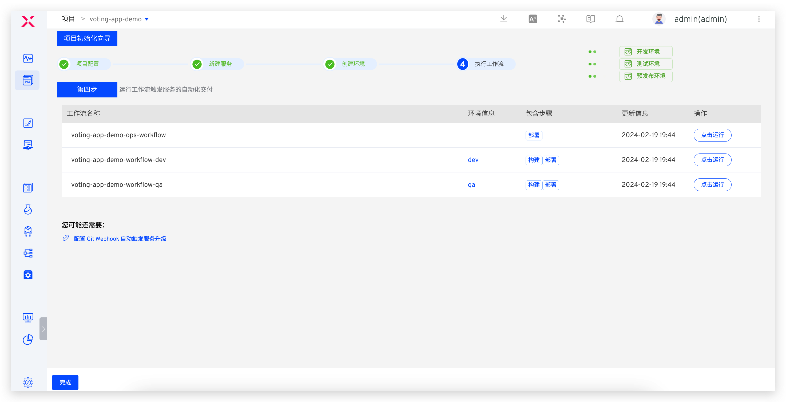
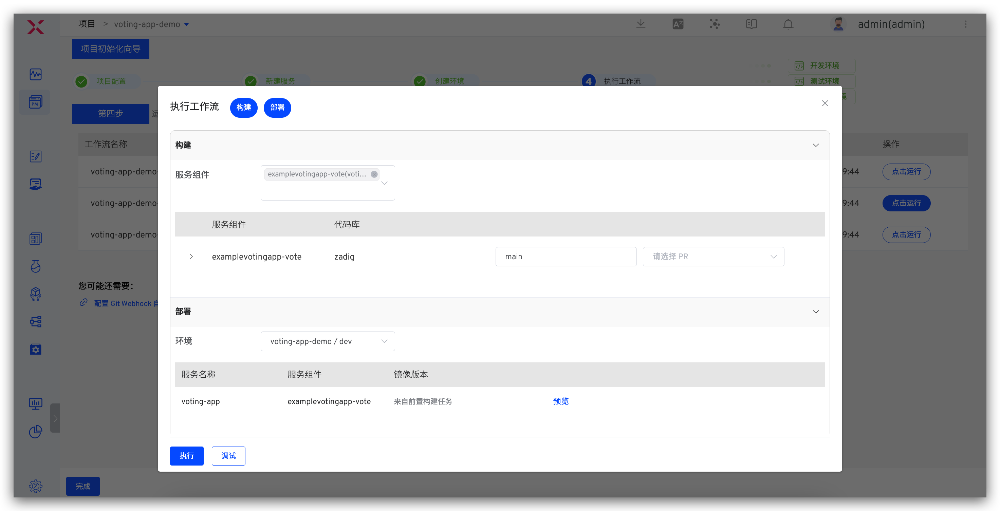
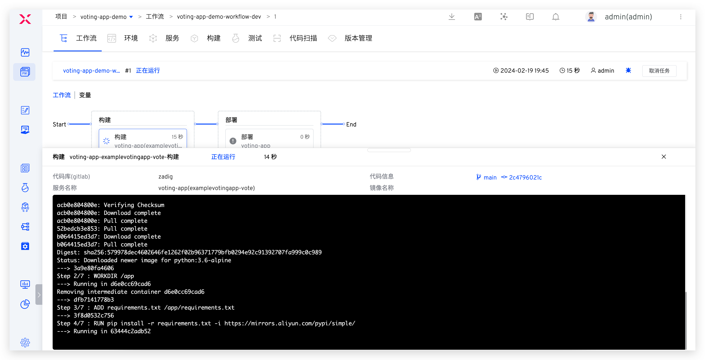
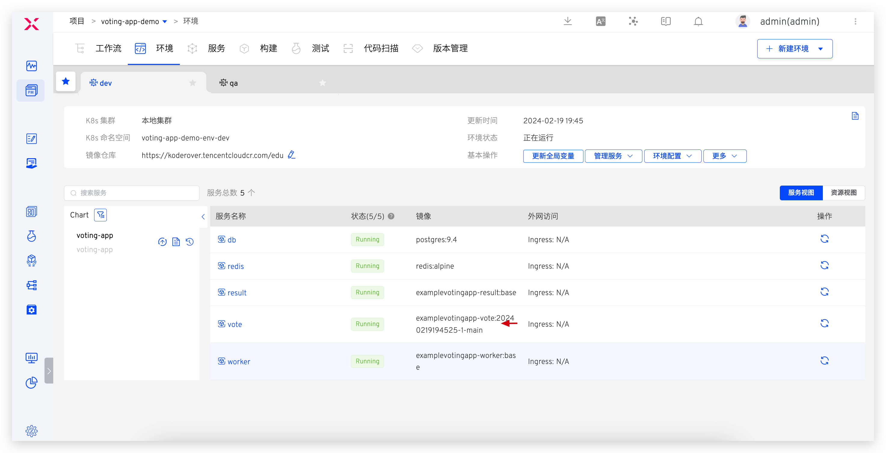

summary: 如何使用 Zadig 实现 Helm Chart 应用的持续交付
id: helm-chart
categories: Helm Chart
environments: Web
status: Published
feedback link: https://github.com/koderover/zadig-bootcamp/issues

# 如何使用 Zadig 实现 Helm Chart 应用的持续交付

## 概述

Duration: 0:01:00

Positive
: 本教程适用于 Zadig v2.2.0 及以上版本。

Helm 作为 K8s 生态工具之一，将互相关联的多个资源（比如：Deployment、StatefulSet、Service、Ingress...）统一打包成一个整体（Chart）交给 K8s 运行。对于应用发布者而言，可以通过 Helm 打包应用、管理应用依赖关系、管理应用版本并发布应用到 Chart 仓库。 对于使用者而言，无需编写复杂的应用部署 YAML 文件，以便捷的方式在 K8s 上查找、安装、升级、回滚、卸载应用程序。

本文将介绍在 Zadig 中如何持续交付使用 Helm Chart 管理的应用。

## 准备工作

Duration: 0:02:00

首先需要准备应用的 Helm Chart 配置，本文中我们将使用 [voting-app](https://github.com/koderover/zadig/tree/main/examples/voting-app/chart) 案例来实践，如果你也使用此项目，可以选择以下方法，然后在系统中集成代码源。代码源集成的具体方法可点击 [链接](https://docs.koderover.com/zadig/settings/codehost/overview) 查看。
- 选项 1：Fork koderover/zadig 代码库到自己的 GitHub 仓库
- 选项 2：下载 koderover/zadig 代码库，并上传至自己的代码仓库中


voting-app 案例是一个简单的投票统计系统，包含 5 个微服务 db、redis、result、vote、worker，其 Helm Chart 配置目录结构说明如下：
```
zadig/examples/voting-app/chart # Chart 根目录
├── Chart.yaml                # Chart 中所必须的 chart.yaml 文件
├── templates                 # Chart 中的模板目录，5 个微服务的 K8s YAML 配置声明
│   ├── db.yaml
│   ├── redis.yaml
│   ├── result.yaml
│   ├── vote.yaml
│   └── worker.yaml
└── values.yaml               # Chart 默认的配置值
```

## 项目配置

Duration: 0:01:00

进入 Zadig 系统，点击`新建项目`。



填写项目名称 `voting-app-demo` -> 选择 `K8s Helm Chart 项目` -> 点击`立即新建` -> 点击`下一步`。


## 创建服务

Duration: 0:03:00

点击 `从代码库同步` 来创建服务。


选择代码源等信息并选择 Chart 所在的文件夹后点击`加载`即可。其中代码源即为准备工作中集成的代码源，文件夹请勾选 `examples/voting-app/chart`。



加载文件夹内容后，系统会自动解析出整个 Chart 中的服务信息。点击`添加构建`来为服务配置构建，以便后续对该服务进行持续部署更新。



Positive
: 欲了解关于服务组件的更多信息，可参考：[核心概念](https://docs.koderover.com/zadig/quick-start/concepts/#服务组件)。

## 配置构建

Duration: 0:03:00

我们以服务组件 `examplevotingapp_vote` 为例来演示，详细构建配置如下图所示。
- `构建方式`：Zadig 构建
- `构建名称`：voting-app-demo-build-service-vote
- `代码源`：来自于准备工作中集成的代码信息
- `通用构建脚本`：内容如下：

```bash
#!/bin/bash
set -ex

cd $WORKSPACE/zadig/examples/voting-app/vote
docker build -t $IMAGE -f Dockerfile .
docker push $IMAGE
```


保存构建配置后点击`下一步`。


## 创建环境

Duration: 0:01:00

点击`创建环境`，系统会自动创建 `dev`、`qa` 两套环境，待环境创建完毕后点击`下一步`。

小贴士：
1. 在后续的使用中，`dev` 环境可用于开发工程师日常自测联调；`qa` 环境可用于测试开发工程师做验收测试。
2. 如果不需要系统自动创建的环境，也可以点击环境名右侧的编辑/删除/创建按钮来自定义。




## 工作流交付

Duration: 0:03:00

系统会自动创建 3 条工作流用于后续的持续交付，点击运行工作流 `voting-app-demo-workflow-dev`，更新 `dev` 环境的 `vote` 服务。




在工作流任务中点击展开构建过程，可查看详细的构建日志，以及此次将构建出来的镜像产物。



待工作流任务执行完毕，进入到 `dev` 环境中，可发现 `vote` 服务的镜像信息被更新。



## 进阶：代码变更自动触发服务部署

Duration: 0:05:00

只需要在工作流中配置触发器，即可实现：有代码变更时，自动触发工作流执行部署更新服务的效果。

### 第一步：配置代码变更触发器

以 `voting-app-demo-workflow-dev` 工作流示例，编辑工作流配置触发器如下图。


### 第二步：代码改动后自动交付

以代码变更 pull request 事件为例，提交 pull request 后会自动触发工作流执行。


待工作流运行完毕后查看环境，可见 `vote` 服务的镜像被自动更新。


