summary: Zadig 环境托管让开发过程更顺滑
id: Hosting-Namespace
categories: 环境
environments: Web
status: Published
feedback link: https://github.com/koderover/zadig-bootcamp/issues

# Zadig 环境托管让开发过程更顺滑

## 概述

Duration: 0:01:00

本文主要介绍如何使用 Zadig 环境托管能力，让开发过程更顺畅。

我们都知道，服务的容器化消除了线上线下的环境差异，保证了应用生命周期的环境一致性标准化，为软件交付提供了诸多好处。但上了容器以后研发过程中使用测试环境却存在诸多不便，比如环境的不透明，导致联调测试过程诊断问题困难；而原生 kubectl 方式操作繁琐，调试服务不方便等等。

Zadig 可以通过托管现有环境解决以上问题，并且对现有环境无任何的侵入性，开发者可以方便的对服务进行查看、管理和更新，比如服务查看、Pod Debug、实时日志等。

## 准备工作

Duration: 0:01:00

下面以 microservice-demo 项目为例来演示。该项目情况的基本介绍：
- 该项目包含两个简单的微服务： Vue.js 前端服务和 Golang 后端服务
- 现有集群中已存在 dev 环境用于日常的开发测试
- 客户使用 Jenkins Pipeline 对 Dev 环境进行更新

## 创建项目

Duration: 0:02:00

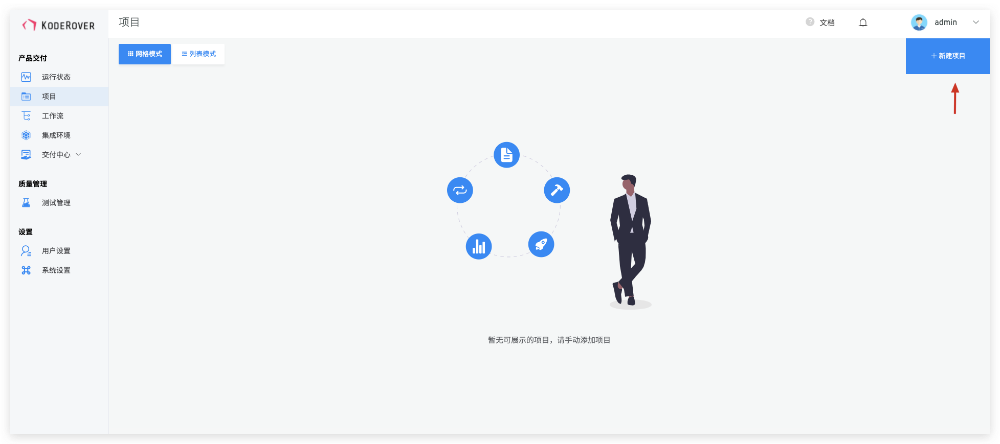

选择对应的基础设施和部署方式，microservice-demo 项目是用 Kubernetes YAML 部署的，所以这里，选择 「K8s YAML」部署。

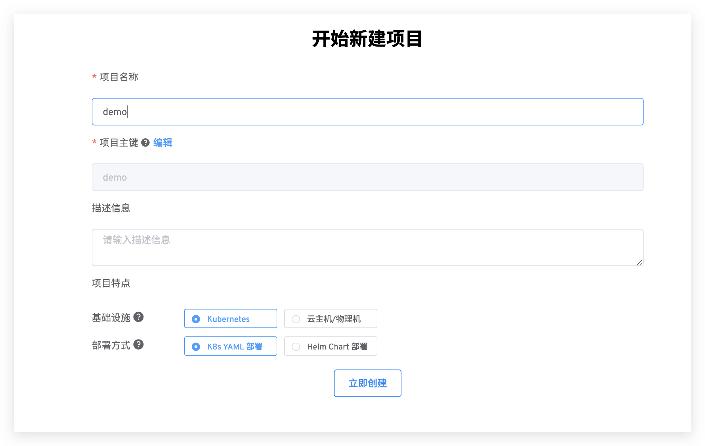

创建完成后，进入项目向导，项目向导包括了完整的服务创建，环境创建，工作流创建等过程，此处我们只使用托管环境的能力，所以跳过完整的向导过程，直接进入 Zadig 集成环境页面。

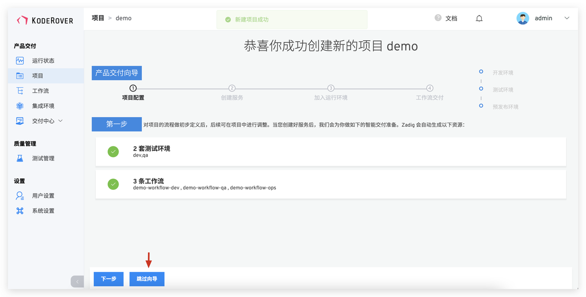

## 创建托管环境

Duration: 0:01:00

进入集成环境页面，点击`托管环境`->填写环境信息，如下所示。

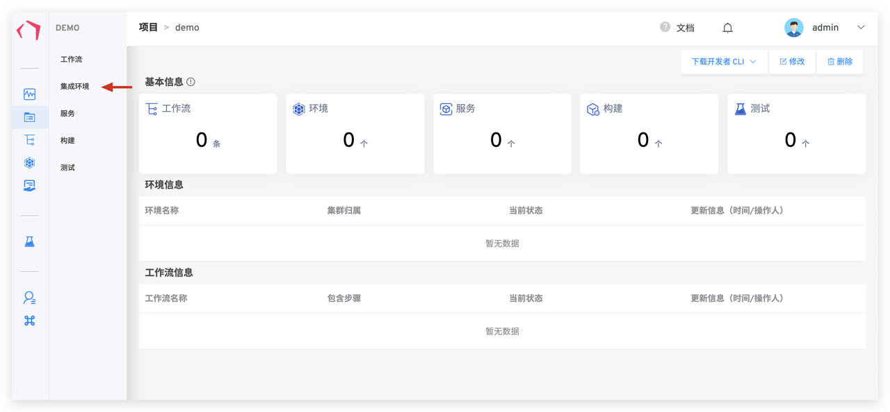
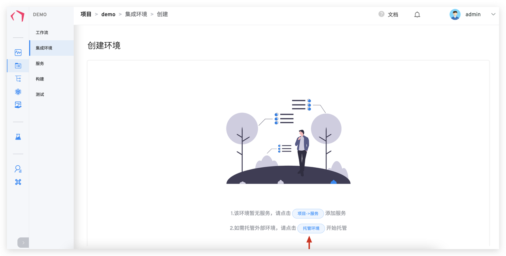
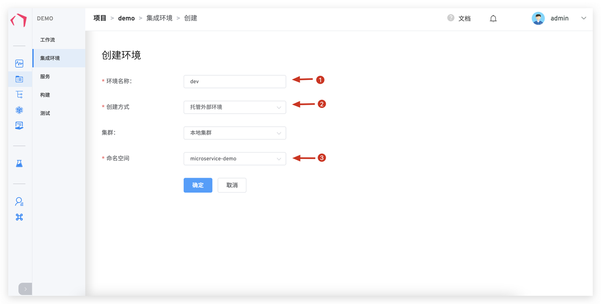

说明：
- 1. 填写环境名称 dev。
- 2. 创建方式选择`托管外部环境`。
- 3. 命名空间选择需要托管的 Namespace，这里我们选择 "microservice-demo"。

点击确认后，即可创建托管环境。

## 查看托管环境

Duration: 0:02:00

创建托管环境成功后，我们就可以在 Zadig 上看到 dev 环境下的所有服务信息，如图所示：

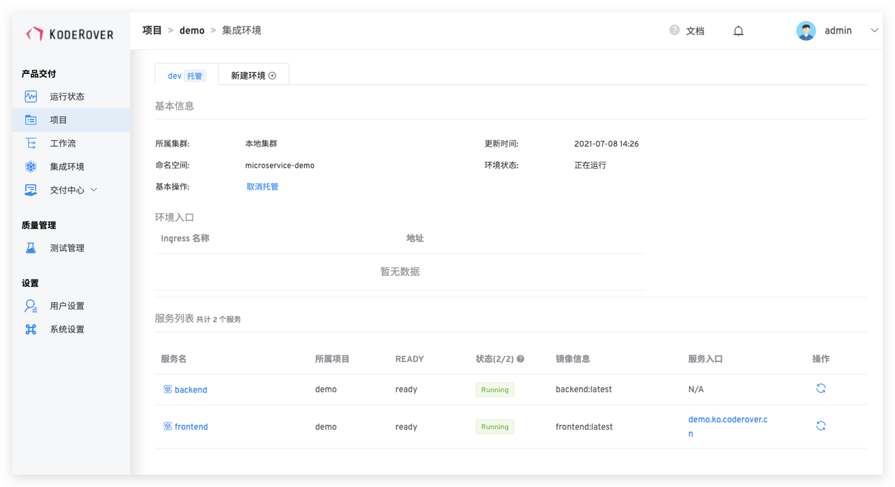

这里我们可以查看服务访问入口，服务的状态、服务的镜像信息，也可以对服务进行重启操作。

点击服务名，进入服务详情页。在服务详情页，可以查看服务的访问方式、服务的镜像、副本、服务的实时日志等信息，可以切换服务镜像、调整服务副本数量、重启实例、登入服务容器中进行调试等等

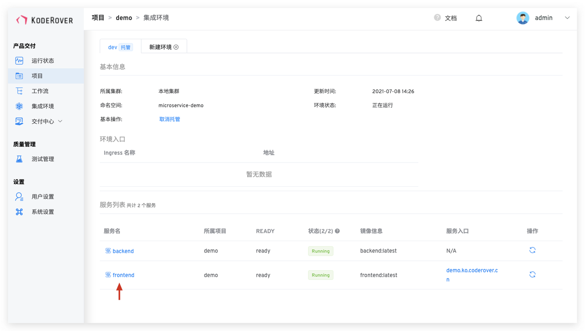

### 服务详情：

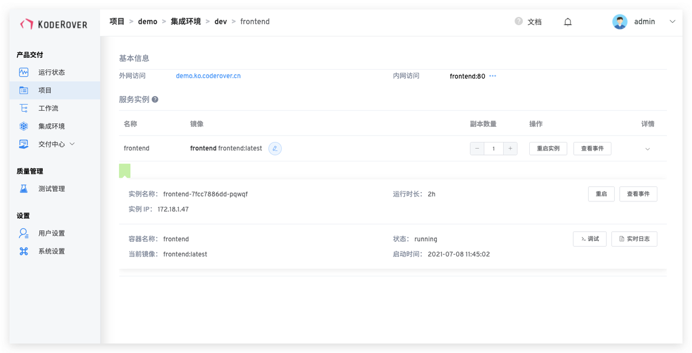

### 容器调试：

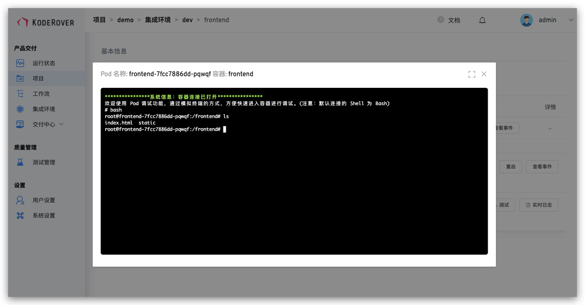
 

## 使用 Jenkins Pipeline 更新现有环境

Duration: 0:04:00

使用 Jenkins Pipeline 更新服务镜像，Jenkins Pipeline 包括构建镜像和更新服务镜像过程，大致配置如下：

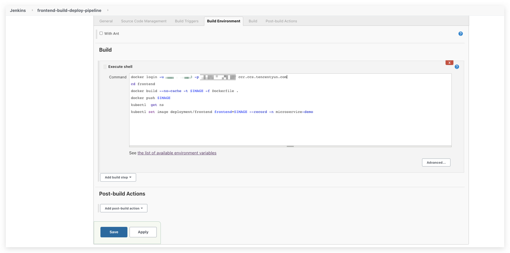

这里我们更新 frontend 服务，在服务详情中，可以看到更新前服务版本为 "frontend:latest"，通过域名访问 microservice-demo 项目，更新前状态如下所示：

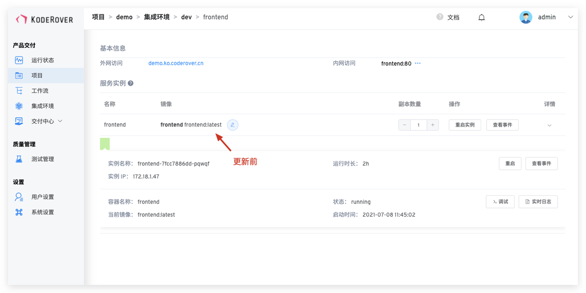
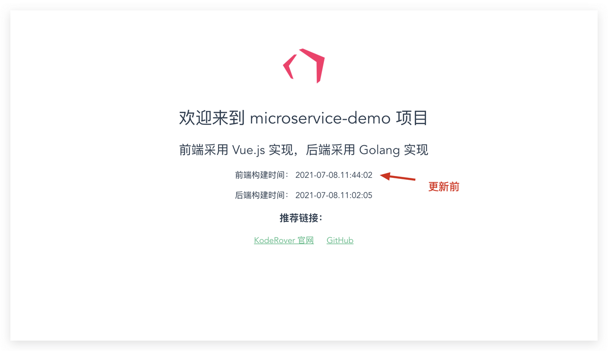

执行 Jenkins Pipeline 更新服务后，服务版本为"frontend:20210708"，通过域名访问 microservice-demo  项目，实际更新效果如下所示：

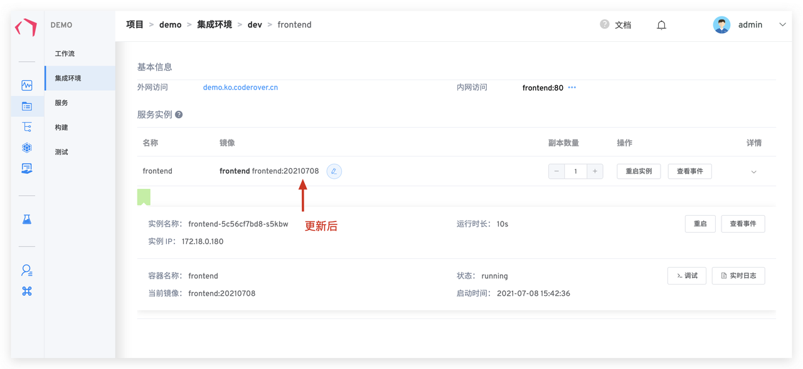
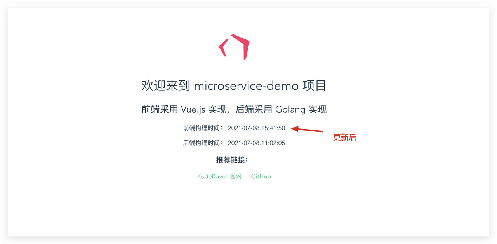

至此我们可以借助 Jenkins 和 Zadig 环境托管的能力进行日常迭代。使用 Zadig 托管现有环境，测试环境更贴近开发者一线工作，给开发联调测试带来极大的便利。