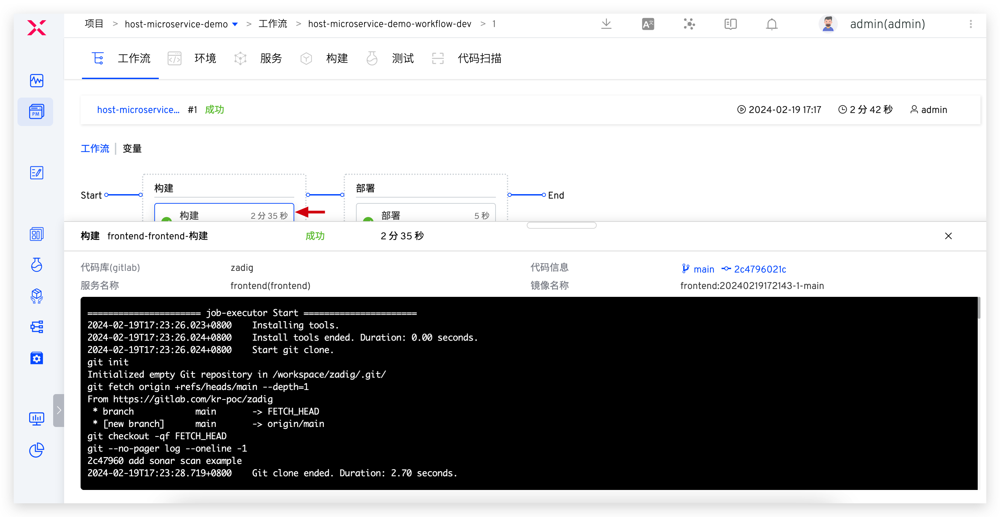
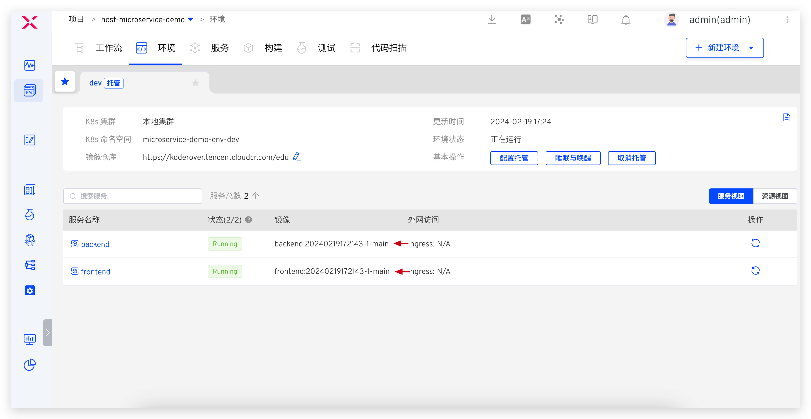

summary: Zadig 环境托管让开发过程更顺滑
id: Hosting-Namespace
categories: 环境
environments: Web
status: Published
feedback link: https://github.com/koderover/zadig-bootcamp/issues

# Zadig 环境托管让开发过程更顺滑

## 概述

Duration: 0:01:00

本文主要介绍如何使用 Zadig 环境托管能力，让开发过程更顺畅。

我们都知道，服务的容器化消除了线上线下的环境差异，保证了应用生命周期的环境一致性标准化，为软件交付提供了诸多好处。但上了容器以后研发过程中使用测试环境却存在诸多不便，比如环境的不透明，导致联调测试过程诊断问题困难；而原生 kubectl 方式操作繁琐，调试服务不方便等等。

Zadig 可以通过托管现有环境解决以上问题，并且对现有环境无任何的侵入性，开发者可以方便的对服务进行查看、管理和更新，比如服务镜像更新、Pod Debug、实时日志查看等。

## 准备工作

Duration: 0:05:00

下面以 microservice-demo 项目为例来演示。该项目的基本情况简述如下：
- 该项目包含两个简单的微服务： Vue.js 前端服务和 Golang 后端服务。实现的功能：在页面中显示前后端服务的构建时间
- 该项目中的 2 个微服务部署在 microservice 命名空间中
- 项目案例源代码及服务配置：[microservice-demo](https://github.com/koderover/zadig/tree/main/examples/microservice-demo)

提示：

为部署更新服务，下文中有为服务配置构建的环节，依赖 [Zadig 代码库](https://github.com/koderover/zadig)。如果您也使用该项目中的服务进行托管的实践：
1. 请先 fork [Zadig 代码库](https://github.com/koderover/zadig)至个人仓库，并在系统设置中集成对应代码源，参考：[集成代码源](https://docs.koderover.com/zadig/v1.8.0/settings/codehost/github/)
2. 此处提供将上述服务部署到集群 microservice 命名空间的快捷操作：
- 将 [frontend](https://github.com/koderover/zadig/blob/main/examples/microservice-demo/k8s-yaml/frontend/) 下三个文件的内容依次保存为 deployment-frontend.yaml、ingress-frontend.yaml、service-frontend.yaml，请根据自己的域名及解析情况按需修改 [frontend 服务的 ingress 域名](https://github.com/koderover/zadig/blob/main/examples/microservice-demo/k8s-yaml/frontend/ingress.yaml#L12) ，并在集群中执行：
    - kubectl -n microservice apply -f deployment-frontend.yaml
    - kubectl -n microservice apply -f service-frontend.yaml
    - kubectl -n microservice apply -f ingress-frontend.yaml
- 将 [backend](https://github.com/koderover/zadig/blob/main/examples/microservice-demo/k8s-yaml/backend/) 下两个文件的内容依次保存为 deployment-backend.yaml、service-backend.yaml，并在集群中执行：
    - kubectl -n microservice apply -f deployment-backend.yaml
    - kubectl -n microservice apply -f service-backend.yaml


## 创建托管项目

Duration: 0:01:00

系统管理员进入 Zadig 系统，点击新建项目，环境创建方式中选择`托管现有环境`，创建托管项目 host-microservice-demo：


## 配置环境托管

Duration: 0:01:00

创建项目后，进入产品交付向导的第一步，配置环境托管环节：

- 填写环境名称：dev
- 选择待托管服务所在的集群：本地集群
- 选择待托管服务所在的命名空间：microservice
- 选择要被托管的 backend 服务和 frontend 服务

点击`下一步`，进入配置服务构建步骤。


## 配置服务构建

Duration: 0:03:00

### frontend 服务

- 选择 `frontend` 服务，为其配置构建：


- 填写构建配置和脚本并保存，如下图所示：


- 构建脚本如下：

``` bash
#!/bin/bash
set -e

cd zadig/examples/microservice-demo/frontend
docker build -t $IMAGE -f Dockerfile .
docker push $IMAGE
```

### backend 服务

- 同样的操作步骤为 backend 服务配置构建：


- 构建脚本如下：

``` bash
#!/bin/bash
set -e

cd zadig/examples/microservice-demo/backend
make build-backend
docker build -t $IMAGE -f Dockerfile .
docker push $IMAGE
```

- 点击`下一步`，系统会自动创建 1 条工作流用于对托管服务做持续变更，点击`完成`结束对 dev 环境的托管配置。


## 查看托管环境

Duration: 0:02:00

创建托管环境成功后，进入项目的集成环境页面，就可以看到 dev 环境下的所有服务基本信息，如下图所示：


点击具体的服务进入详情页，可以对被托管服务进行更新，包括重复服务实例、切换服务镜像、调整服务副本数量；还可以查看服务实时日志、搜索服务实时日志、登入服务容器中进行调试等等。

- 服务详情和基本操作：


- 服务实时日志：


- 登入服务容器调试：


## 使用工作流部署更新服务

Duration: 0:04:00

### 手动运行工作流部署更新服务

- 进入项目的工作流页面，点击`执行`，选择集成环境和服务后启动任务：


- 可以查看工作流执行情况以及构建过程中的实时日志：



- 待工作流运行完毕，查看服务的镜像版本，被成功更新：



- 访问服务站点，发现前后端的构建时间已按照预期更新：


### [可选]配置 Webhook 自动部署更新服务

- 修改工作流，增加`触发器`配置并保存：


- 提交代码变更，Webhook 事件触发工作流自动运行，按照触发器配置更新服务：


- 工作流运行完毕后，服务更新成功：


