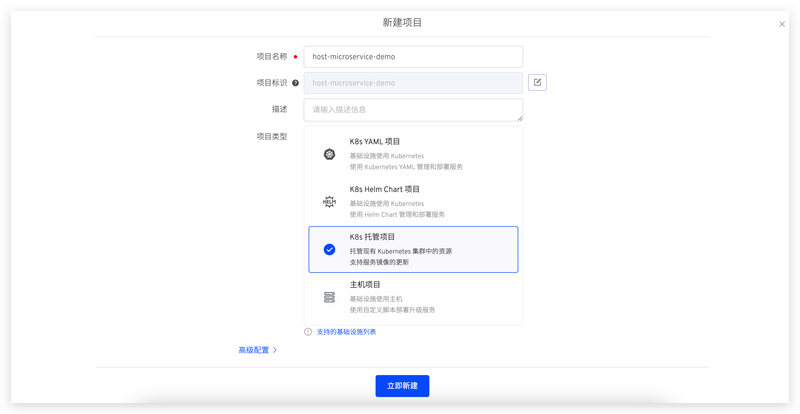
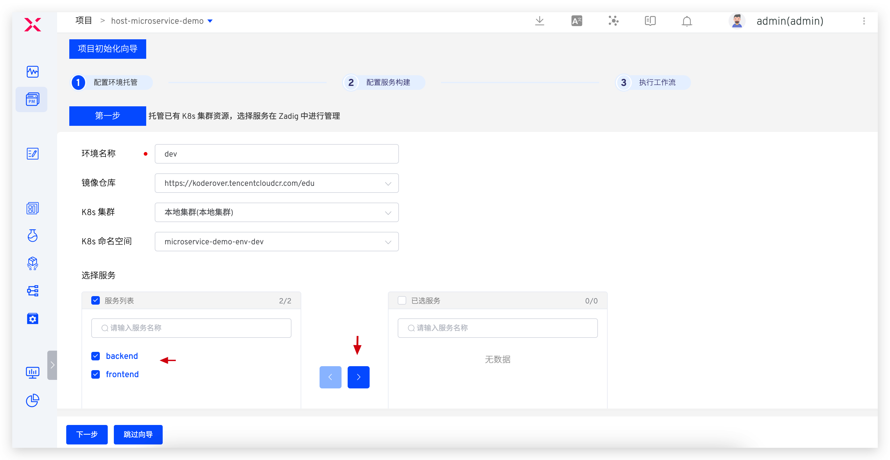
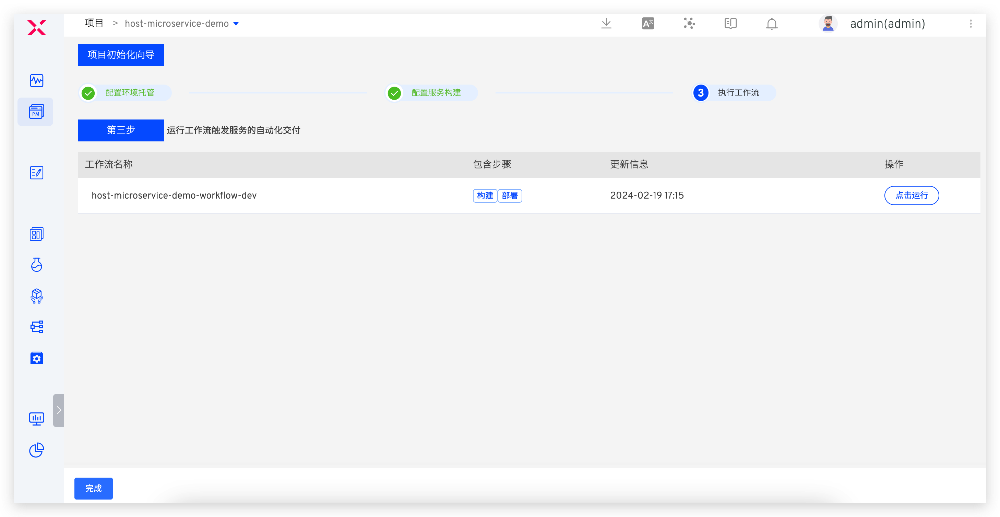
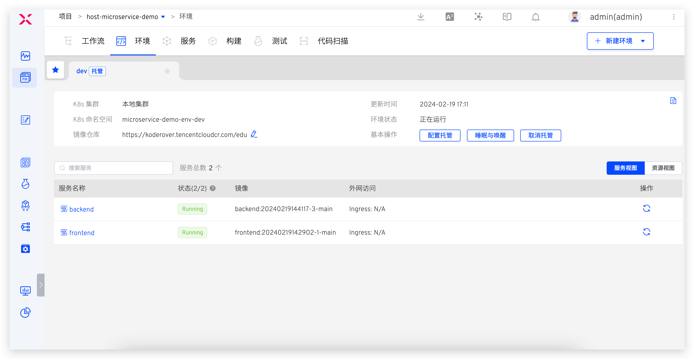
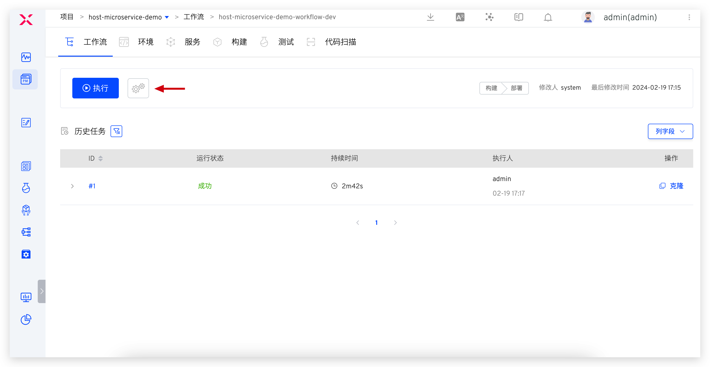
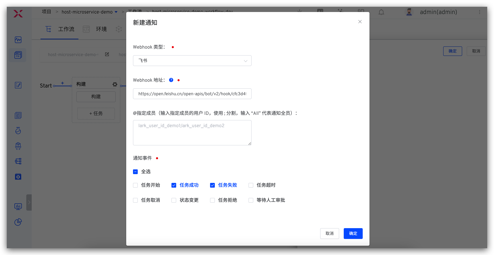

summary: Zadig 环境托管让开发过程更顺滑
id: Hosting-Namespace
categories: 环境
environments: Web
status: Published
feedback link: https://github.com/koderover/zadig-bootcamp/issues

# Zadig 环境托管让开发过程更顺滑

## 概述

Duration: 0:01:00

本文主要介绍如何使用 Zadig 环境托管能力，让开发过程更顺畅。

我们都知道，服务的容器化消除了线上线下的环境差异，保证了应用生命周期的环境一致性标准化，为软件交付提供了诸多好处。但上了容器以后研发过程中使用测试环境却存在诸多不便。环境的不透明，导致联调测试过程诊断问题困难；而原生 kubectl 方式操作繁琐，调试服务不方便等等。

Zadig 可以通过托管项目解决以上问题，并且对现有集群无任何的侵入性，平滑实现云原生 DevOps 开发模式。不同业务线可以清晰的管理所属的服务，开发者也可以方便的对服务进行查看、管理和更新，比如服务查看、Pod Debug、实时日志等。原理如下：


## 准备工作

Duration: 0:05:00

### 案例背景

下面以 host-microservice-demo 项目为例来演示。该项目的基本情况简述如下：
- 该项目包含两个简单的微服务： Vue.js 前端服务和 Golang 后端服务。实现的功能：在页面中显示前后端服务的构建时间
- 该项目中的 2 个微服务部署在 microservice 命名空间中
- 项目案例源代码及服务配置：[microservice-demo](https://github.com/koderover/zadig/tree/main/examples/microservice-demo)

### 小贴士

如果完全依照本教程进行托管的实践，需要参考上述背景在自己的集群中部署相关服务，将案例源码 [microservice-demo](https://github.com/koderover/zadig/tree/main/examples/microservice-demo) 克隆到本地后，根据自己的域名及解析情况按需修改 [ingress 域名](https://github.com/koderover/zadig/blob/main/examples/microservice-demo/k8s-yaml/frontend/ingress.yaml#L12)，执行以下快捷操作：

``` bash
cd {microservice-demo 所在的目录}/k8s-yaml/backend && kubectl -n microservice apply -f .
cd {microservice-demo 所在的目录}/k8s-yaml/frontend && kubectl -n microservice apply -f .
```

此外，为部署更新服务，下文中有为服务配置构建的环节，依赖 [Zadig 代码库](https://github.com/koderover/zadig)，请先 fork [Zadig 代码库](https://github.com/koderover/zadig)至个人仓库，并在系统设置中集成对应代码源，参考：[集成代码源](https://docs.koderover.com/zadig/v1.8.0/settings/codehost/github/)

## 创建托管项目

Duration: 0:01:00

系统管理员进入 Zadig 系统，点击`新建项目` -> 填写项目名称 `host-microservice-demo` -> 选择 `K8s 托管项目` -> 点击立即创建。




## 配置环境托管

Duration: 0:01:00

创建项目后，进入产品交付向导的第一步，配置环境托管环节。



说明如下：
- `环境名称`：填写环境名称，方便阅读有意义即可，此例中为 `dev`
- `关联镜像仓库`：选择镜像仓库
- `K8s 集群`：待托管管理的服务所在的 K8s 集群
- `K8s 命名空间`：待托管管理的服务所在的命名空间，此例中为 `microservice`
- `选择服务`：勾选要托管的服务（frontend + backend）并通过穿梭框

点击`下一步`，进入配置服务构建步骤。

## 配置服务构建

Duration: 0:03:00

### frontend 服务

- 选择 `frontend` 服务，点击`添加构建`：


- 填写构建配置和脚本并保存，如下图所示：


- 构建脚本如下：

``` bash
#!/bin/bash
set -e

cd zadig/examples/microservice-demo/frontend
docker build -t $IMAGE -f Dockerfile .
docker push $IMAGE
```

### backend 服务

- 同样的操作步骤为 backend 服务配置构建：


- 构建脚本如下：

``` bash
#!/bin/bash
set -e

cd zadig/examples/microservice-demo/backend
make build-backend
docker build -t $IMAGE -f Dockerfile .
docker push $IMAGE
```

- 点击`下一步`，系统会自动创建 1 条工作流用于对托管服务做持续变更，点击`完成`结束对 dev 环境的托管配置。



## 查看托管环境

Duration: 0:02:00

创建托管环境成功后，进入项目的环境页面，就可以看到 dev 环境下的所有服务基本信息，如下图所示：



点击具体的服务进入详情页，可以对被托管服务进行更新，包括重复服务实例、切换服务镜像、调整服务副本数量；还可以查看/搜索服务实时日志、登入服务容器中进行调试等等。

- 服务详情和基本操作：


- 服务实时日志：


- 登入服务容器调试：


## 使用工作流部署更新服务

Duration: 0:04:00

### 手动运行工作流部署更新服务

- 进入项目的工作流页面，点击`执行`，选择环境和服务后启动任务：


- 可以查看工作流执行情况以及构建过程中的实时日志：


- 待工作流运行完毕，查看服务的镜像版本，被成功更新：


### [可选]配置 Webhook 自动更新服务

- 修改工作流，增加`触发器`配置并保存对工作流的修改：




- 提交代码变更后，Webhook 事件会触发工作流自动运行，点击右侧的 `Details` 链接可快速跳转到触发的工作流


- 工作流运行完毕后，进入环境查看服务被更新成功：


## IM 通知

Duration: 0:02:00

- 配置工作流，参考 [IM 通知](https://docs.koderover.com/zadig/v1.11.0/project/workflow/#im-%E7%8A%B6%E6%80%81%E9%80%9A%E7%9F%A5)配置 IM 通知 -> 保存修改



- 工作流执行后，会自动将运行结果和环境、服务等信息推送到 IM 系统中，方便及时跟进


