summary: 使用 Nocalhost 加速 Zadig 开发
id: Nocalhost
categories: 生态伙伴
environments: Web
status: Published
feedback link: https://github.com/koderover/zadig-bootcamp/issues

# 使用 Nocalhost 加速 Zadig 开发

众所周知，在 `Kubernetes` 环境下开发应用是非常困难的，一般的做法是本地修改完源码后，需要重新构建镜像，推送到仓库，修改工作负载镜像版本，等待 Pod 调度再查看编码效果，这通常需要几分钟的时间，并极大地降低了编码效率。

本文主要介绍如何使用 `Nocalhost` 来加速 Zadig 的开发过程 ，并以 `aslan` 微服务为案例讲解。

## 前置条件

Duration: 0:01:00

* 准备一个 Kubernetes 集群（Minkube 或公有云），v1.12.0+ 版本
* 已在集群内安装 Zadig

## 安装 Nocalhost 插件

Duration: 0:01:00

前往 [https://nocalhost.dev/eng/installation/](https://nocalhost.dev/eng/installation/)，根据指引安装 VSCode 或 Jetbrains 插件。

## 在插件内添加 Kubecofig

Duration: 0:01:00

以 `Goland` 为例，打开右侧菜单的 `Nocalhost` 插件，并点击 "+" 按钮，选择 "Paste as Text" 黏贴 `Kubeconfig`（建议使用具有管理员权限的 kubeconfig）


点击确认后添加集群。

在插件中展开集群，将列出集群所有的 `Namespace`。

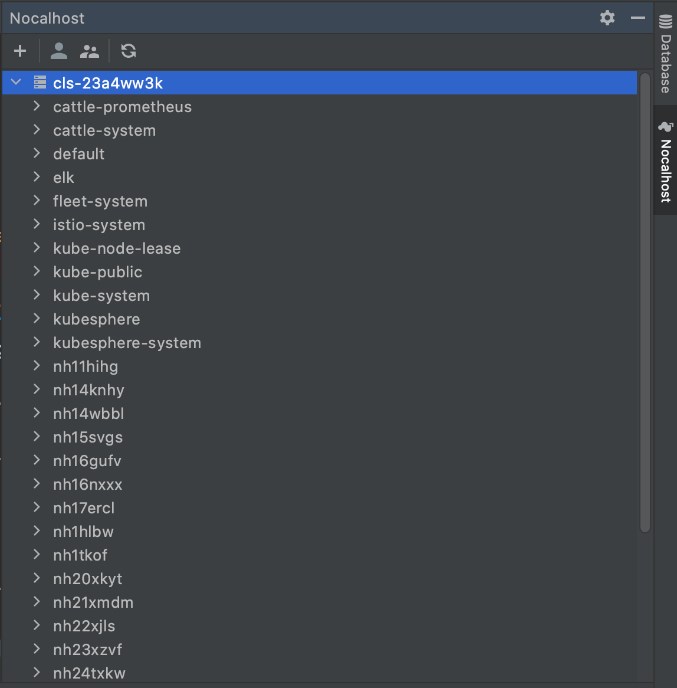

## 配置 `aslan` Deployment 开发参数

Duration: 0:01:00

确保之前已使用 `Helm` 方式安装 `Zadig`，在 Nocalhost 插件中展开 "Zadig" Namespace，找到 `aslan` 微服务，右键点击该微服务，选择 "Config" 配置服务开发参数，并将以下开发参数黏贴到编辑窗口中，**并保存（Mac: Command+s, Windows: Ctrl+s）。**

```
name: aslan
serviceType: deployment
containers:
  - name: aslan
    dev:
        gitUrl: https://github.com/koderover/zadig.git
        image: codingcorp-docker.pkg.coding.net/nocalhost/dev-images/golang:zadig
        shell: /bin/zsh
        workDir: /root/nocalhost-dev
        command:
            run:
              - go
              - run
              - ./cmd/aslan/main.go
            debug:
              - dlv
              - debug
              - ./cmd/aslan/main.go
              - --listen=:2345
              - --headless=true
              - --api-version=2
              - --accept-multiclient
        debug:
            remoteDebugPort: 2345

```

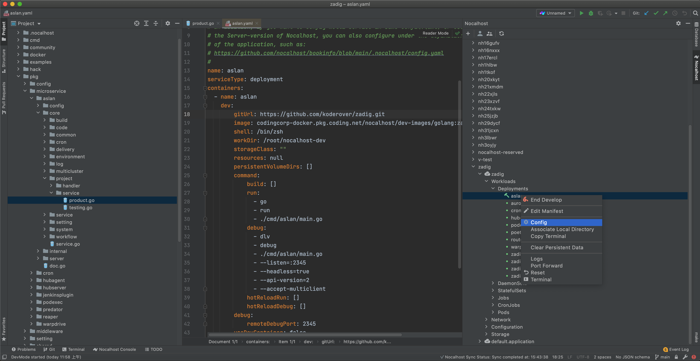


## 添加 Goland `Nocalhost Go` 配置

Duration: 0:01:00

Nocalhost 自带一键 `Run` 和一键 `Debug` 的功能，使用前首先需要添加配置。

点击 "Goland" 右上角的 "Edit Configurations"。

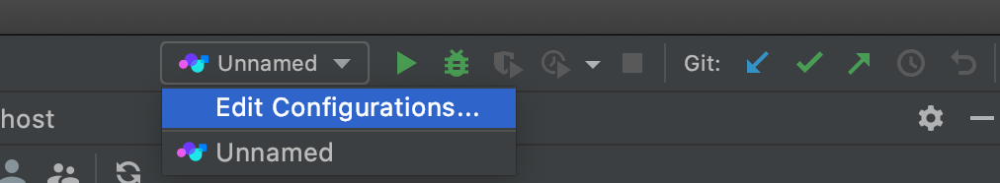

点击 "+" 添加 "Nocalhost Go" 配置，并确认

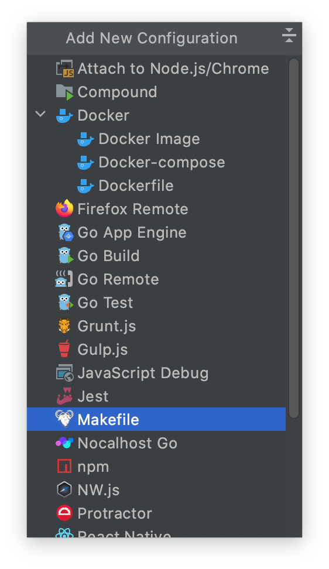


## 选择 `aslan` Deployment 进入开发模式

Duration: 0:05:00

配置完开发参数和`Nocalhost Go` 配置后，右击 `aslan` Deployment，选择 "Start Develop"。

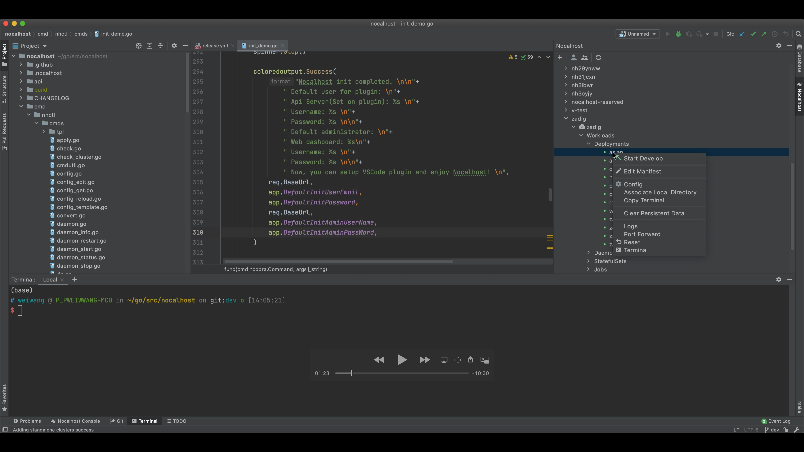

由于 `aslan` 服务存在多个容器，选择 `aslan` 容器进入开发模式。

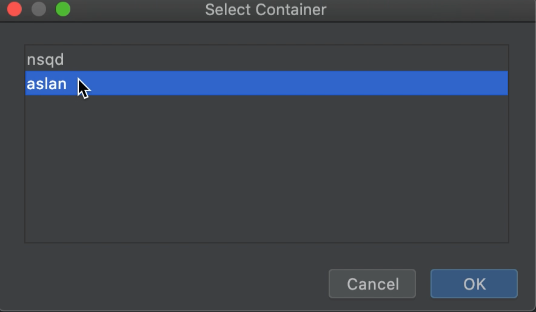

进入开发模式后，将弹出选择源码目录来源对话框。

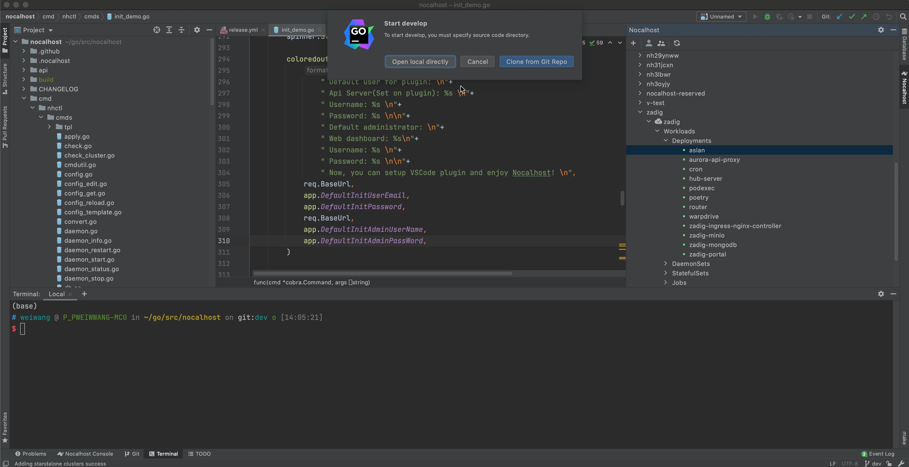

选项解释：

* 如果本地已有 `Zadig` 源码，那么请选择 "Open local directly" 选择本地目录
* 如果第一次参与 `Zadig` 贡献，那么请选择 "Clone from Git Repo"

以使用 "Clone from Git Repo" 方式为例，克隆完成后，将自动打开源码目录。

此时，Nocalhost 将进入 `aslan` 服务的开发模式，**第一次进入开发模式可能需要 5 分钟以上（拉取开发镜像），请耐心等待。**

进入开发模式后，将在 `Goland` 底部终端栏自动打开**远端开发容器的** `Terminal`，执行 `ls` 会发现开发容器内已包含源码，该源码由本地实时同步至远端。

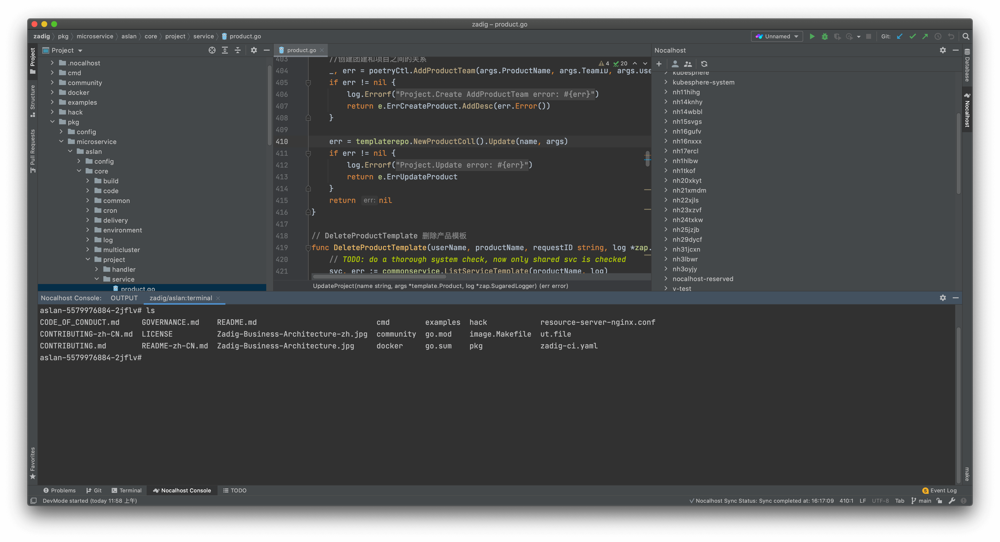

## 开发

Duration: 0:04:00

现在，对本地源码的所有修改，都将实时同步到远端容器。

以修改“编辑项目”接口 "/api/aslan/project/products" 为例（pkg/microservice/aslan/core/project/service/product.go），在该文件的 402 行增加代码，并保存。

```
return e.ErrUpdateProduct.AddErr(errors.New("code change here"))
```

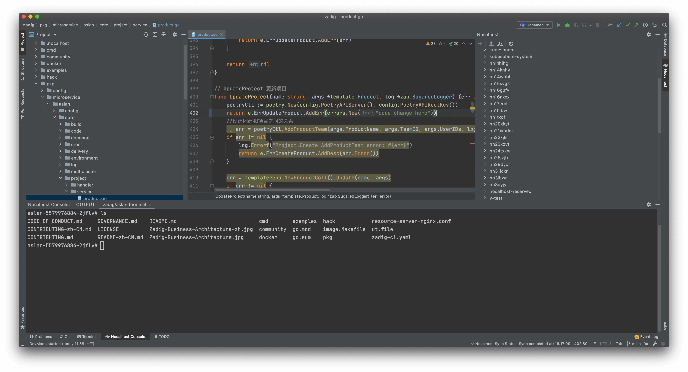

修改源码后，由于需要重新编译，选择 `Goland` 右上角的 "Nocalhost Go" 配置，并点击 "Run" Icon 即可在开发容器内启动 `aslan` 服务。

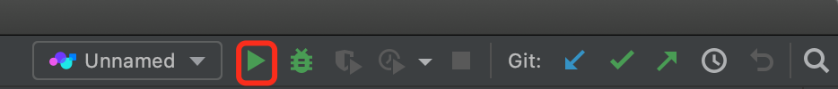

当看到 `App Aslan Started at` 输出，说明 `aslan` 服务已启动。

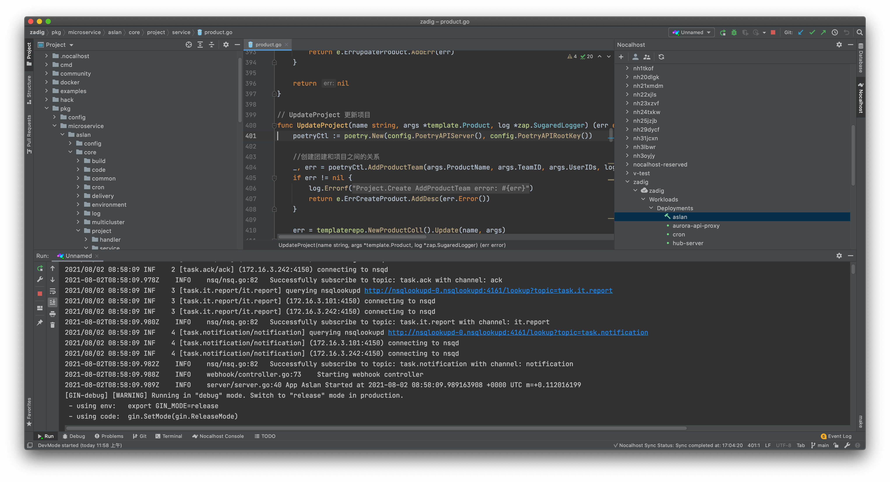

此时，进入 Web 控制台“编辑项目”页面，点击保存后将出现报错信息。


至此，实现了本地修改源码后，只需要在 `Goland` 内点击 "Run" Icon 即可查看修改效果，实现了秒级的开发/自测循环反馈。

## 一键调试

Duration: 0:01:00

仍然以调试“编辑项目”接口 "/api/aslan/project/products" 为例（pkg/microservice/aslan/core/project/service/product.go），在该文件的 401 行增加断点。

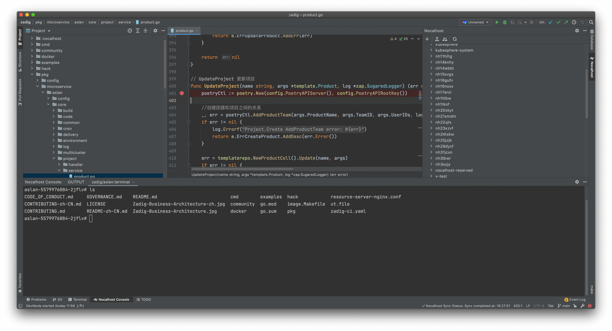

点击 "Debug" Icon 即可启动 `aslan` 服务的调试模式。

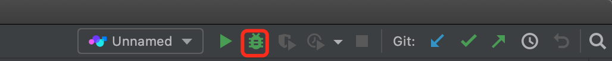

当看到 `App Aslan Started at` 输出，说明 `aslan` 服务已启动。

此时进入 Web 控制台“编辑项目”页面，点击保存后 `Goland` 将得到断点信息。

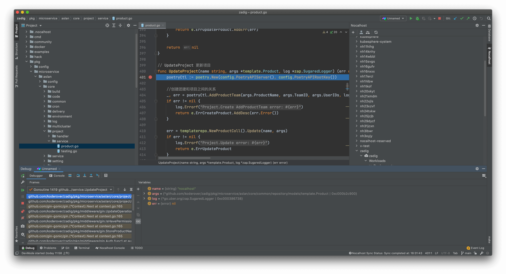
