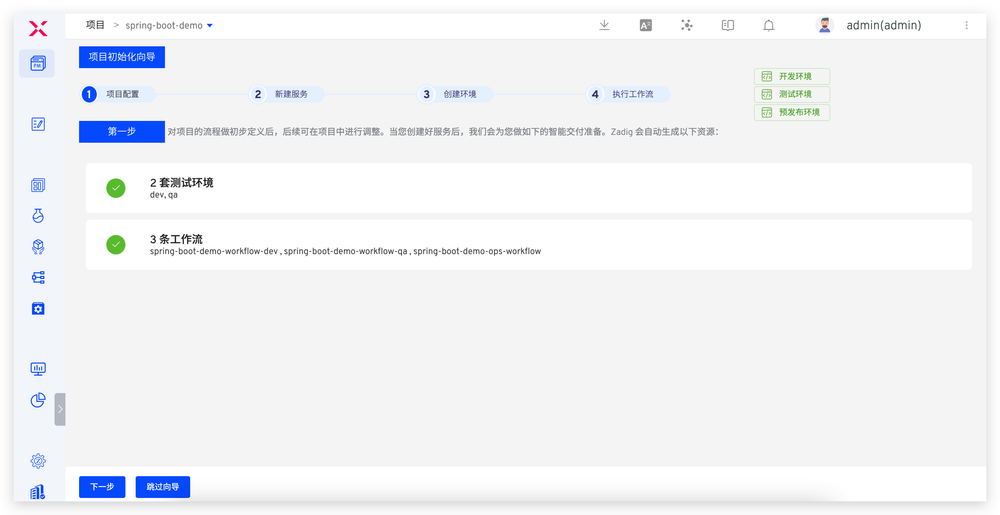
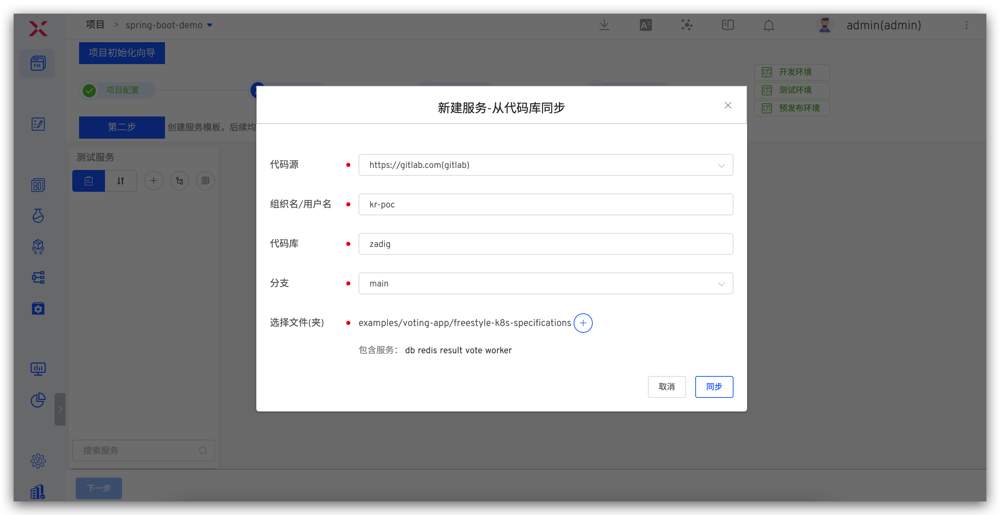
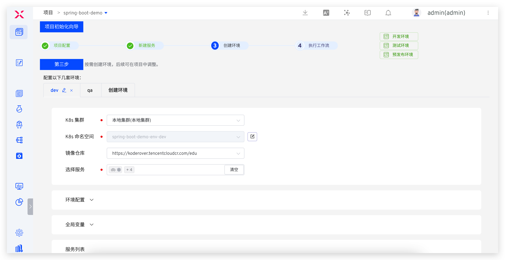
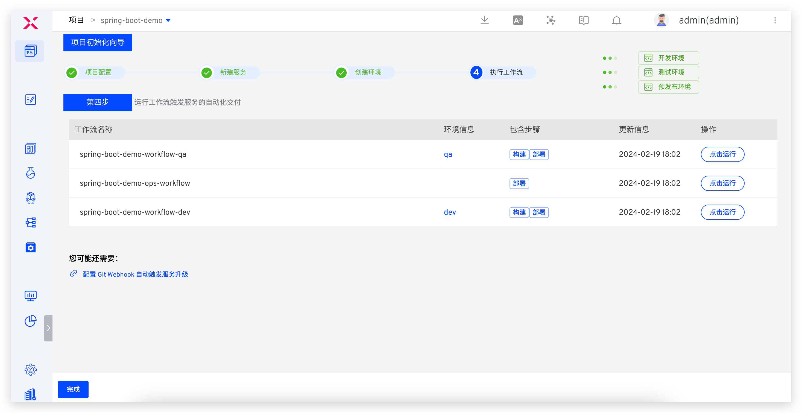
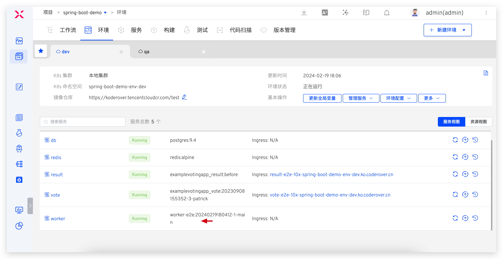
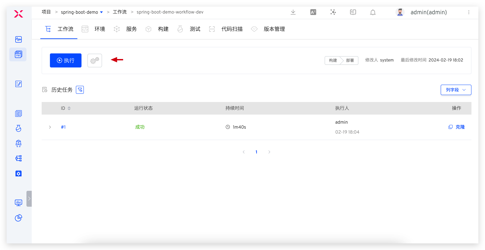
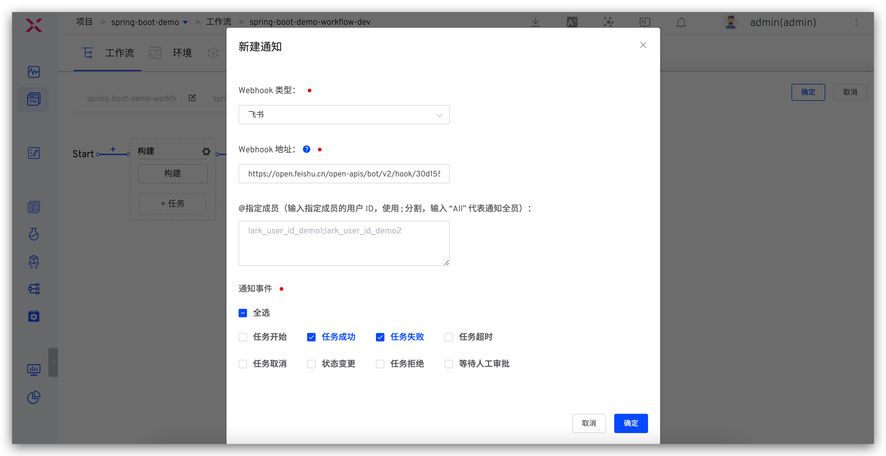

summary: 如何使用 Zadig 将 Spring Boot 项目持续交付到 Kubernetes 上
id: springboot
categories: Spring Boot
environments: Web
status: Published
feedback link: https://github.com/koderover/zadig-bootcamp/issues

# 如何使用 Zadig 将 Spring Boot 项目持续交付到 Kubernetes 上

## 概述

Duration: 0:01:00

本文介绍如何在 Zadig 上快速搭建 Spring Boot 项目。Spring Boot 是构建 Java 后端应用程序的一种非常流行的框架，本文以 [voting-app] (https://github.com/koderover/zadig/tree/main/examples/voting-app) 案例作为实践，演示从 Code 到 Ship 的整个过程。

## 准备工作

Duration: 0:02:00

本案例所用代码 fork 自 [zadig 仓库](https://github.com/koderover/zadig)，[voting-app] (https://github.com/koderover/zadig/tree/main/examples/voting-app) 项目包括 5 个微服务（redis、db、worker、result、vote），其中 worker 服务以及其依赖的 redis、db(Postgres) 服务使用 Spring Boot 框架，细节信息如下：
- 服务的 K8s YAML 配置文件：[`YAML`](https://github.com/koderover/zadig/tree/main/examples/voting-app/freestyle-k8s-specifications/)
- 服务源码：[`worker`](https://github.com/koderover/zadig/tree/main/examples/voting-app/worker/src/main/java/worker/Worker.java)
- worker 服务的 Dockerfile 文件：[`Dockerfile`](https://github.com/koderover/zadig/tree/main/examples/voting-app/worker/Dockerfile.j)

## 项目配置

Duration: 0:02:00

- 进入 Zadig 系统，点击`新建项目` -> 填写项目名称 `spring-boot-demo` -> 选择 `K8s YAML 项目` -> 点击`立即创建` -> 点击`下一步`。




## 新建服务并配置构建

Duration: 0:03:00

### 新建服务

Positive
: 服务配置指的是 YAML 对这个服务的定义，Kubernetes 可以根据这个定义产生出服务实例。可以理解为 Service as Code。

Zadig 提供三种方式管理服务配置：
- 手工输入：在创建服务时手动输入服务的 K8s YAML 配置文件，内容存储在 Zadig 系统中。
- 从代码库同步：服务的 K8s YAML 配置文件在代码库中，从代码库中同步服务配置。之后提交到该代码库的 YAML 变更会被自动同步到 Zadig 系统上。
- 使用模板新建：在 Zadig 平台中创建服务 K8s YAML 模板，创建服务时，在模板的基础上对服务进行重新定义。

这里，我们使用从代码库同步的方式。点击`从代码库同步`按钮 -> 选择仓库信息 -> 选择文件目录 `examples` -> `voting-app` -> `freestyle-k8s-specifications` -> 点击`同步`按钮即可。



### 配置构建

接下来为服务配置构建，以便于后续对服务进行持续交付，具体操作步骤：选择 `worker` 服务 -> 点击`添加构建` -> 填写代码信息和构建脚本后保存。


构建配置说明：
1. 代码信息：fork 的 zadig 仓库
2. 构建脚本如下：

```bash
cd $WORKSPACE/zadig/examples/voting-app/worker
docker build -t $IMAGE -f Dockerfile.j .
docker push $IMAGE
```

## 加入环境

Duration: 0:01:00

点击向导的「下一步」。这时，Zadig 会根据你的配置，创建两套包括上述微服务的环境以及相关工作流，如下图所示。



继续点击下一步完成向导流程。



至此，一个包含 5 个微服务的项目、2 套环境、3 条工作流已经产生，项目概览如下。


## 工作流交付

Duration: 0:01:00

使用工作流对 worker 服务进行部署更新，以 dev 环境为例操作步骤如下。

- 点击运行 `spring-boot-demo-workflow-dev` 工作流 -> 选择 worker 服务，点击「启动任务」运行工作流。


- 触发工作流后，可查看工作流运行状况，点击服务左侧的展开图标可查看服务构建的实时日志。


- 待工作流运行完毕，进入 dev 环境，可看到 worker 服务被部署更新成功，镜像信息被更新。



## 配置自动触发工作流

Duration: 0:02:00

添加触发器，使得代码 Push commit、Pull Request、Push tag 都能自动触发服务的重新构建和部署。

- 配置 `spring-boot-demo-dev` 工作流



- 添加 Webhook 触发器 -> 打开 Webhook 开关 -> 添加配置 -> 填写配置 -> 保存 Webhook 配置 -> 保存对工作流的修改


## 改动代码，自动触发工作流

Duration: 0:02:00

- 以 Pull requests 事件为例：提交 PR 修改源代码，在 PR 页面中会有被触发工作流的信息，可点击链接快速跳转到触发的工作流


- 待工作流执行完毕，进入项目的环境中，可看到服务的镜像已被自动触发的工作流更新


## IM 通知

Duration: 0:01:00

- 配置工作流


- 添加通知 -> 参考 [IM 通知](https://docs.koderover.com/zadig/v1.11.0/project/workflow/#im-%e7%8a%b6%e6%80%81%e9%80%9a%e7%9f%a5)填写相关配置 -> 保存修改



- 工作流执行后，会自动将运行结果和环境、服务等信息推送到 IM 系统中，方便及时跟进


