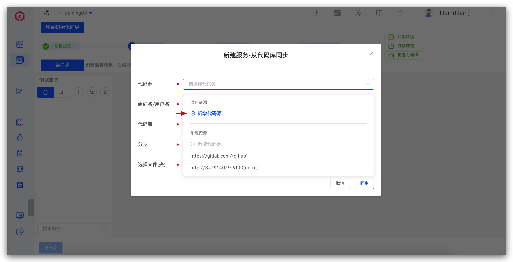
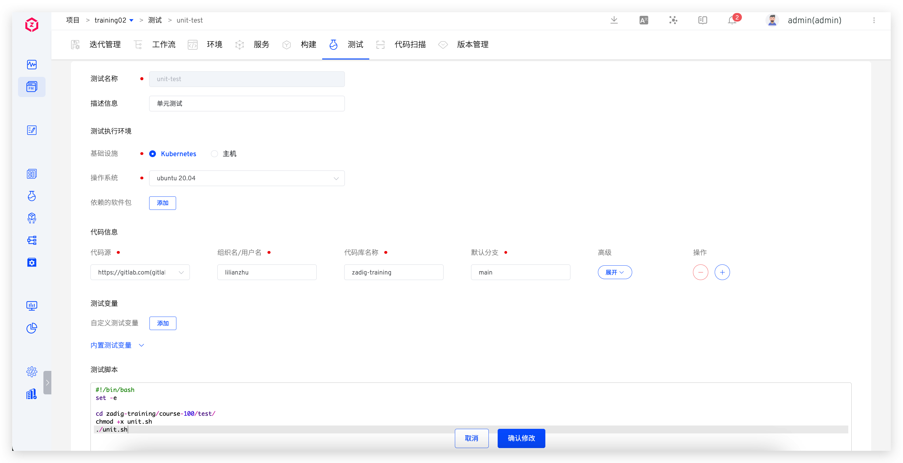
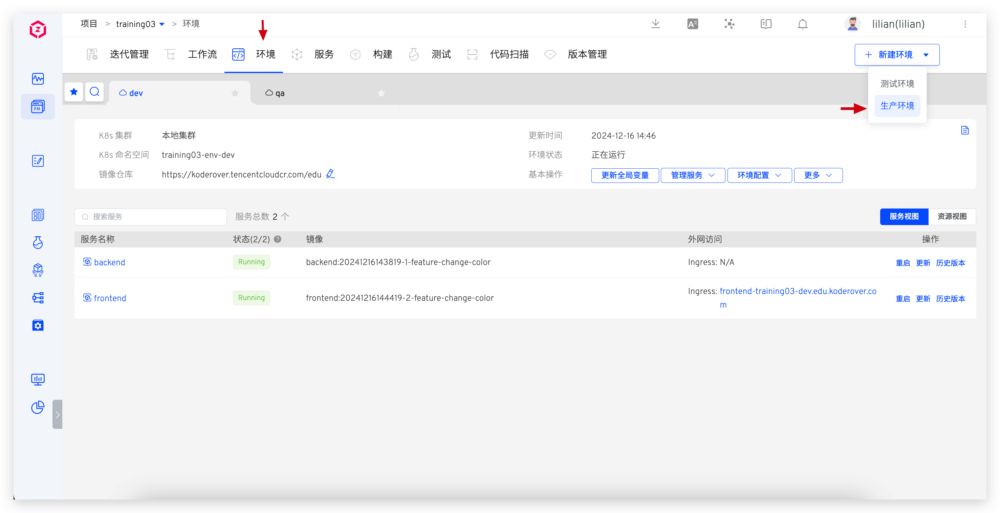

summary: Zadig 新手快速入门课程 T100
id: t100
categories: training
environments: Web
status: Published
authors: Lilian Zhu
Feedback Link:  https://github.com/koderover/zadig-bootcamp/issues

# Zadig 新手快速入门课程 T100
<!-- ------------------------ -->


## 准备环境
Duration: 2

### 学习内容

- 准备 Zadig 试用环境：[在线试用](https://koderover.com/trial)或者[下载安装](https://koderover.com/installer)。
- 将示例代码 Fork 到个人账户中，为变更这套代码做好准备。
- 在 GitLab 中创建用于代码仓库集成接入的应用认证密钥。

### 示例应用代码

本课程基于一套可以运行的云原生微服务系统，该应用系统的架构图如下：


* 前端：只有一个页面，该页面上显示着两条动态的信息：前端程序构建的时间戳，后端服务构建的时间戳（通过调用后端 /api/buildstamp 接口获得）
* 后端：运行在 20219 端口上，由几个简单的示例 api 组成。
* 前后端是松耦合的结构，前后端开发人员可以在同一套环境中各自独立开发迭代。

代码库位于：<https://gitlab.com/kr-poc/zadig-training.git>，将该代码库 fork 到个人账号中。

### 创建 GitLab 集成密钥

具体创建过程，参考 [GitLab 集成文档](https://docs.koderover.com/zadig/settings/codehost/gitlab/)

创建过程中需要填写 Zadig 的回调网址为：`https://course.koderover.com/api/directory/codehosts/callback`

创建成功的应用认证密钥，如下图所示：


将 `Application ID` 和 `Secret` 复制备用。

<!-- ------------------------ -->
## 初始化项目
Duration: 3

### 学习内容
- 初始化一个 K8s YAML 项目
- 集成个人代码源
- 配置项目中的服务、构建、环境和工作流

### 操作流程

成功登录 Zadig 系统后，即可以开始下面的操作。


在项目模块中，点击新建项目，输入项目基本信息。

1. 填写项目名称
2. 填写项目描述
3. 项目类型：选择 “K8s YAML 项目”
4. 点击 “立即新建” 按钮，开始项目初始向导。


查看 Zadig 系统内置的环境和工作流，包含两套环境和三条工作流。


点击 “下一步” 按钮，继续后续项目定义配置操作。


从这里开始要配置该软件所包含的各个微服务定义，代码文件夹 course-100 中的 K8s-yaml 子目录提供了所需要的服务定义描述。

点击“从代码库同步”按钮，开始对接代码库（你 GitLab 个人账户中的 zadig-training 代码库）。



1. 点击 “代码源” 的下拉菜单
2. 点击 “新增代码源” 按钮
3. 开始接入 GitLab 个人代码仓库


注意：这个步骤中需要使用上一节中所创建的 GitLab 应用认证密钥对。

1. 代码源：选择 Gitlab。
2. 代码源标识：输入可识别的标识
3. Application ID：上一节创建 application 获得的 ID
4. Secret：上一节创建 application 获得的 Secret
5. 点击前往授权，页面会跳转到 GitLab 的页面，点击授权按钮后，即完成代码源系统集成操作。


在成功的接入了 GitLab 个人代码库之后，可以为当前项目选择使用 Fork 好的代码库。

1. 代码源：选择上一步创建的新的源代码。
2. 组织名/用户名：选择自己的 GitLab 账户名
3. 代码库：选择 fork 在自己账号下的 `zadig-training`
4. 分支：选择 `main` 分支
5. 点击选择文件夹按钮，这里是选择微服务定义描述 yaml 文件所在目录。


1. 选择正确的路径 “course-100/k8s-yaml”
2. 点击 “确定” 按钮。


1. 这里识别出了两个微服务，如果实际项目代码中，不是所有微服务定义文件都在一个文件夹中，则需要重复本步骤，依次添加其他所有服务。
2. 点击 `同步` 按钮，Zadig 将批量导入这些微服务定义。


1. 点击 backend 服务名称，查看相关定义文件
2. 点击 frontend 服务名称，确认相关定义文件

接下来为 backend 和 frontend 服务添加构建配置。

#### 后端服务构建配置


点击 backend 服务名称，添加构建配置。


- 依赖的软件包：选择系统内置的 go 1.20.7 版本。
- 代码信息：选择个人账号下的 `zading-training` 代码库，默认分支选择 main。
- 构建脚本：填入以下内容

```bash
#!/bin/bash
cd zadig-training/course-100/backend
make build-backend 

docker build -t $IMAGE -f Dockerfile .
docker push $IMAGE

```

#### 前端服务构建配置


点击 frontend 服务名称，添加构建配置。


- 代码信息：选择个人账号下的 `zading-training` 代码库，默认分支选择 main。
- 构建脚本：填入以下内容

```bash
#!/bin/bash
cd zadig-training/course-100/frontend

docker build -t $IMAGE -f Dockerfile .
docker push $IMAGE
```

两个服务构建配置完成后，点击下一步，继续配置环境。


#### 配置环境


1. 配置两个测试环境 dev 和 qa
2. 为 dev 和 qa 环境配置访问入口域名，这里配置域名后缀为 `edu.koderover.com`
3. 点击 “创建环境” 按钮


1. 这个区域显示创建成功
2. 点击 “下一步”


1. 在这个区域中显示了 Zadig 为当前产品项目所创建的默认工作流，它们具有很好的通用性，可以适用于大多数产品开发。也可以根据实际场景，添加更多的内置任务，以满足复杂的流程编排需求。
2. 点击 “完成”

<!-- ------------------------ -->
## 日常开发
Duration: 5

### 学习内容

1. 编写代码，手动触发工作流执行
2. 代码合并至主干，自动触发工作流执行

### 操作步骤

#### 编写代码，手动触发工作流


1. 点击 “环境” 标签页
2. 这里可以看到前后端服务在当前的 dev 环境中所使用的容器镜像
3. 点击这个前端服务入口 URL，可以访问前端访问的页面，校验应用状态。


在浏览器中可以正常显示；我们现在修改一下推荐链接中的字体颜色。

首先，在命令行中创建一个名为 `feature/change-color` 的分支。参考命令如下：

```sh
git branch feature/change-color
git switch feature/change-color
git push origin feature/change-color
```


1. 用 vs code 打开源代码目录，查看并修改 `HelloWorld_rc.vue` 文件的第 70 行代码。
2. 执行以下命令，保存并提交改动。

```sh
git add .
git commit -m 'change link color'
git push origin feature/change-color
```


1. 在工作流页面，查看 dev 工作流
2. 点击 “执行” 按钮


1. 在服务组件中选择 frontend 和 backend 服务。
2. 前后端服务均选择使用最新的 `feature/change-color` 分支
3. 点击 “执行” 按钮，手工触发构建刚才变更。


1. 观察正在运行的工作，前后端服务并发构建和部署，可以查看详细的构建信息。
2. 等待两个服务都构建成功


1. 进入环境页面
2. 点击前端服务入口


在浏览器中确认推荐链接中的链接颜色已正确被修改。

#### 合并代码到主干，自动触发工作流

在合并代码到主干前，更新测试工作流，将其改为持续构建的自动触发风格。


点击工作流 “编辑” 按钮，在右侧点击触发器，并添加`Git 触发器`。


1. 填写名称
2. 填写描述
3. 代码库选择 `zadig-training` 仓库
4. 选择目标分支 `main`
5. 触发事件：选择 `Push commits` 和`Pull requests` 事件。
6. 工作流执行变量：构建服务组件选择 `backend` 和 `frontend`。
7.  点击“确认”按钮


回到 GitLab 代码仓库的页面，点击创建 “Create merge request” 按钮。


merge request 信息填写无误后，点击 “create merge request” 按钮。


在 Merge Request 页面观察，对应的 qa 工作流已经开始执行，并实时更新状态。


点击 “Merge” 按钮，合并 `feature/change-color` 分支到主干。

## 调试服务
Duration: 2

### 学习内容

1. 查看服务的的运行状态
2. 通过查看服务日志诊断问题
3. 通过调试容器诊断问题

### 操作步骤


点击 “环境” 标签页，查看服务在对应环境中的基本信息、运行状态、运行版本等等。


1. 点击 backend 服务名称
2. 点击 “实时日志” 查看后端服务的输出日志，分析日志诊断问题。


点击 “调试”，进入容器内部分析网络、磁盘等问题。


1. 在容器的调试界面中，输入如下的 2 条命令
2. 确认后端服务的 api 工作是正常的，这里显示了后端服务程序的构建时间戳，说明后端服务正常。

```bash
apt install curl -y 
curl localhost:20219/api/buildstamp
```

命令行解释：

* 在后端容器的操作系统中安装 curl 命令行工具
* 用 curl 自测后端服务的 api 功能

<!-- ------------------------ -->
## 自动化测试
Duration: 5

### 学习目标

1. 管理测试套件
2. 手动触发测试套件，观察测试结果
3. 编排测试到工作流

### 操作步骤
Positive
: 注意：在本教程的示例代码库中，有一个 `test` 目录；这里存放了若干个用于测试目的的演示脚本。本节的操作会使用到这三个测试脚本。


1. 进入 “测试” 标签页
2. 点击 “新建测试” 按钮



在这个界面中配置自动测试执行相关信息：

1. 测试名称： `unit-test`
2. 代码信息：选择示例项目代码库 `zadig-training`
3. 在测试脚本中输入下面的代码片段
4. 在测试报告的所在目录中输入测试结果的输出路径 `zadig-training/course-100/test/test-report`
5. 最后点击 “确认” 按钮

测试代码片段如下：

```bash
#!/bin/bash
set -e
cd zadig-training/course-100/test/
chmod +x unit.sh
./unit.sh
```


1. 重复上一步的操作，创建 “int-test” 测试套件。
2. 重复上一步的操作，创建 “perf-test” 测试套件。
3. 手工触发 unit-test
4. 手工触发 int-test
5. 手工触发 perf-test
6. 观察测试结果


1. 在测试管理页面中，点击 unit-test 测试，查看测试详情
2. 这里可以看到每一次测试代码运行的详细日志
3. 点击测试报告，查看测试报告详情


这里可以查看和分析测试的具体情况。


1. 找到 qa 工作流，点击 ⚙ 编辑按钮
2. 添加测试阶段，并且添加测试任务
3. 配置测试任务，添加 unit-test、int-test 和 perf-test 套件。
4. 同理，给 dev 和 ops 工作流分别添加测试套件。

这样在 dev、 qa 和 ops 工作流触发的时候，这些绑定的测试套件就自动触发运行。


点击 dev 工作流右侧的 “执行” 按钮，手工测试此工作流。


1. 服务组件中选择 backend 和 frontend 服务，我们可以看到这里有若干与之关联的测试套件，他们会自动被触发。
2. 点击 “执行” 按钮，观察此工作流执行后测试套件的执行。


<!-- ------------------------ -->
## 打版发布与回滚
Duration: 5

### 学习目标

1. 基于 qa 环境创建正式版本
2. 准备生产环境
3. 发布指定版本到生产环境
4. 回滚版本

### 操作步骤

#### 创建版本


1. 点击 “版本管理” 标签页
2. 点击 “创建版本” 按钮


填写版本号、标签、版本描述等基本信息，点击下一步。


1. 环境：选择 qa 环境
2. 服务：选择 frontend 和 backend 服务，点击右侧“添加”按钮
3. 点击下一步


1. 选择生产环境使用的镜像仓库
2. 配置服务的镜像版本 v1
3. 点击完成。


在版本列表中点击版本号，进入版本详情页面，确认版本中镜像推送进展。


版本中包含服务的镜像和 YAML 配置信息，用于后续追溯。

#### 准备生产环境


点击 “生产服务” ，进入生产服务配置页面，准备生产服务配置。


1. 点击“从代码库同步”
2. 代码源：选择集成的个人账号
3. 组织名/用户名：选择个人账号
4. 代码库：选择 `zadig-training`
5. 分支：选择 `main`
6. 文件(夹)：选择 `course-100/k8s-yaml`
7. 点击“同步”

完成服务配置同步后，创建生产环境。



点击 “环境” 标签页，点击 “新建环境” 按钮，选择生产环境。


填写环境名称、K8s 集群、命名空间、镜像仓库、别名，点击 “立即创建”。

至此生产环境就准备好了。

<!-- 

环境创建完成后，添加 backend 和 frontend 服务。点击 “管理服务”，选择 “添加服务”。


在添加服务弹框中，选择 backend 和 frontend 服务，并为生产环境配置访问入口，这里填写 `edu.koderover.com`，点击 “确定” 按钮。


服务都添加成功后，生产环境就准备好了。 -->

#### 发布指定版本


1. 找到 ops 工作流，点击 “编辑”按钮
2. 配置部署任务，环境选择 prod 环境
3. 部署内容勾选上”服务镜像” 、“服务变量”和”服务配置”
4. 点击“确定”，并保存工作流


1. 点击 “执行” 按钮
2. 点击 “选择版本”，选择先前创建的 v1 版本，关闭「服务过滤」，点击 “确定”
   
 

版本中的服务自动加载出来，找到 frontend 服务，配置访问入口地址 `edu.koderover.com`，点击 “执行” 按钮，开始执行生产发布。


工作流执行完成后，点击 “环境” 标签页，找到 prod 环境，查看服务的部署状态。

至此，使用工作流发布指定版本到生产环境的操作已完成。

#### 回滚版本


点击 backend 服务右侧的“历史版本”，在历史版本列表中选择一个可用的版本，点击“回滚”按钮进行回滚操作。

<!-- ------------------------ -->
## 扩展补充
Duration: 2

### 参考链接 

相关文档链接：

- 官网文档 <https://docs.koderover.com/>
- 论坛 <https://community.koderover.com/>

### 课程支持


扫码添加 Zadig 产品助理


关注 KodeRover 获取更多干货
