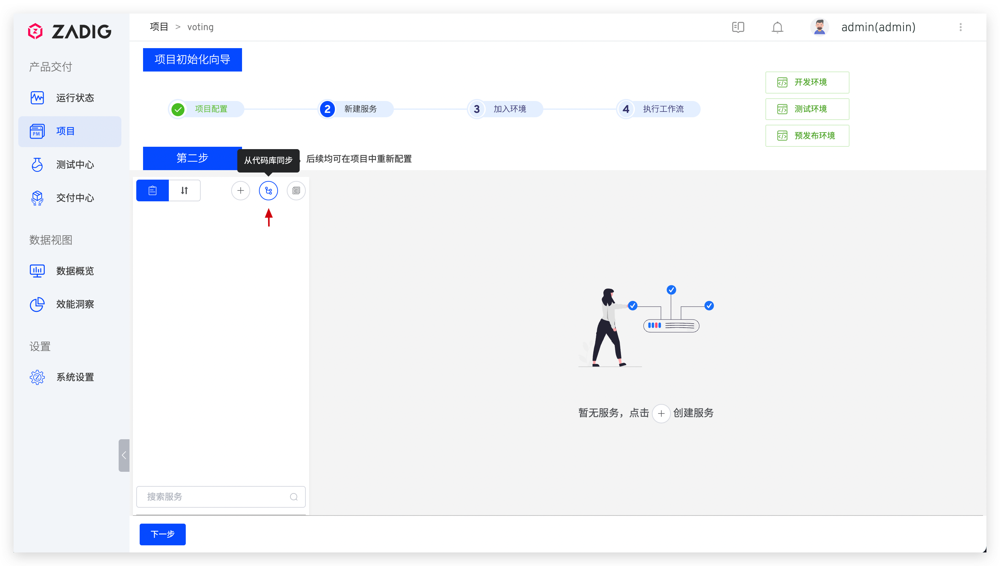
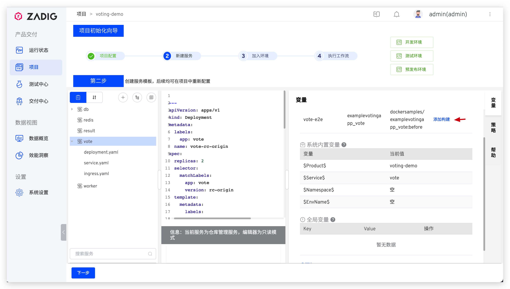
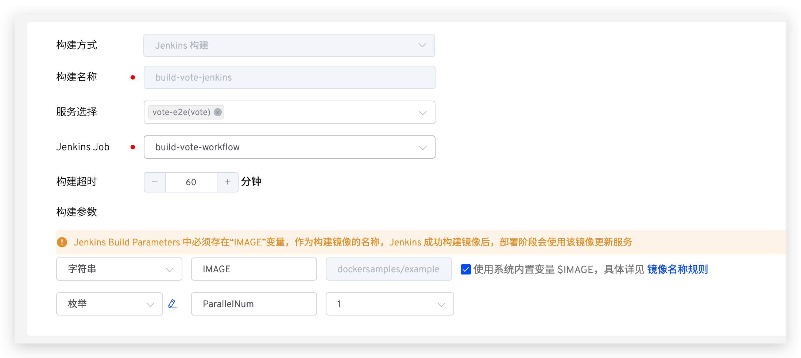
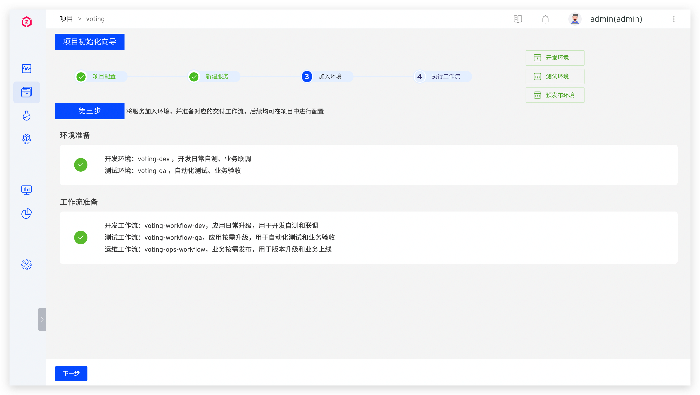
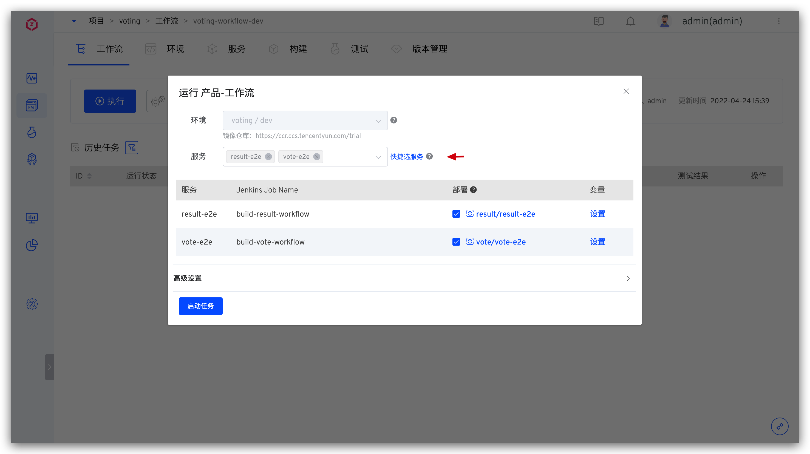
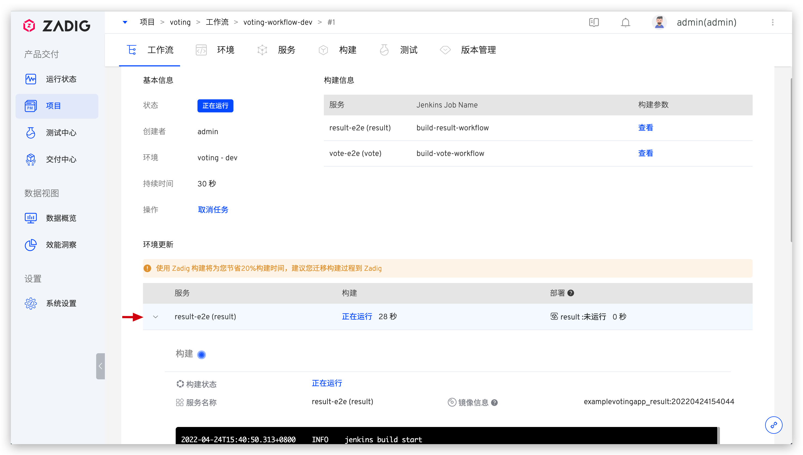
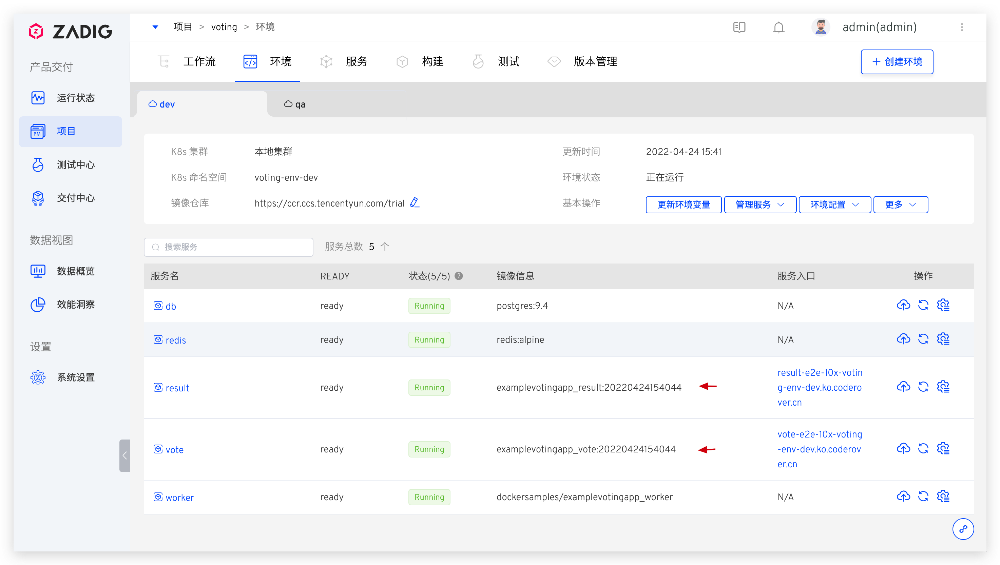
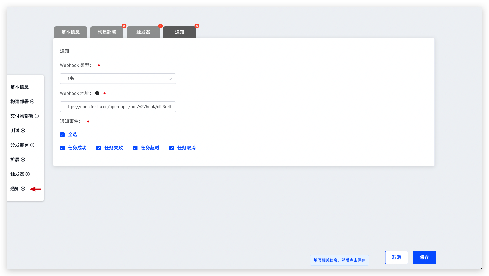

summary: 如何用 Jenkins + Zadig 分分钟搞定测试环境
id: Jenkins
categories: Jenkins
environments: Web
status: Published
feedback link: https://github.com/koderover/zadig-bootcamp/issues

# 基于 Jenkins 构建的团队如何使用 Zadig 实现端到端的丝滑软件交付

## 概述

Duration: 0:01:00

本文主要介绍如何在 Zadig 上快速接入 Jenkins 工作流，实现端到端的微服务架构体系的持续交付。

Jenkins 是一个是基于 Java 开发的、非常经典的开源持续集成项目，被企业和团队广泛应用，但 Jenkins 本身并非云原生设计，随着微服务数量增长、业务架构上云 (Kubernetes) 趋势，工程师还是需要花额外时间对接基础设施、准备环境等等，平均一个工程师要切换若干个平台才能把一段代码写上线。通过现有 Jenkins 接入 Zadig 让团队不需要理解 CI/CD 概念，可以快速获得高并发的工作流和面向服务的集成环境，方便开发日常调试，不再为缺少测试环境，抢占测试环境而困扰。

下面使用 `voting` 作为演示项目，该项目包括 Result、Vote、Worker、DB 和 Redis 这 5 个服务，实现了一个简单的投票系统。

## 准备工作

Duration: 0:02:00

1. 服务的 Jenkins Pipeline
2. 服务的 Kubernetes YAML 文件：[https://github.com/koderover/zadig/tree/main/examples/voting-app/freestyle-k8s-specifications](https://github.com/koderover/zadig/tree/main/examples/voting-app/freestyle-k8s-specifications)

## 集成 Jenkins

Duration: 0:02:00

- 登录 Jenkins，在用户配置中，生成一个 API Token，如下图所示。

- 访问 Zadig，点击 `系统设置` -> `系统集成` -> `Jenkins 集成` ，添加 Jenkins 服务相关信息，如下图所示。

## 项目配置

Duration: 0:01:00

进入 Zadig 系统，点击`新建项目` -> 填写项目名称 `voting` -> 选择 `K8s YAML 项目` -> 点击立即创建。

## 新建服务并配置构建

Duration: 0:03:00

### 新建服务

Negative
: 服务配置指的是 YAML 对这个服务的定义，Kubernetes 可以根据这个定义产生出服务实例。可以理解为 Service as Code。

Zadig 提供三种方式管理服务配置：

* 手工输入：在创建服务时手动输入服务的 K8s YAML 配置文件，内容存储在 Zadig 系统中。
* 从代码库同步：服务的 K8s YAML 配置文件在代码库中，从代码库中同步服务配置。之后提交到该代码库的 YAML 变更会被自动同步到 Zadig 系统上。
* 使用模板新建：在 Zadig 平台中创建服务 K8s YAML 模板，创建服务时，在模板的基础上对服务进行重新定义。

这里，我们使用从代码库同步的方式。点击`从代码库同步`按钮 -> 选择仓库信息 -> 选择文件目录 `examples`->`voting-app`->`freestyle-k8s-specifications` -> 点击`同步`按钮即可在 Zadig 中一次性创建本案例所需的 5 个服务。

### 配置构建

接下来为服务配置构建，以便于后续对服务进行持续交付，以 `vote` 服务为例：选择 `vote` 服务 -> 点击`添加构建`。

参考[如何配置 Jenkins 构建](https://docs.koderover.com/zadig/v1.11.0/project/build/#%E5%A6%82%E4%BD%95%E4%BD%BF%E7%94%A8)完成相关配置，本例中 `vote` 服务构建配置如下。

重复以上构建配置过程，完成 5 个服务的构建配置。

## 加入环境

Duration: 0:01:00

- 点击向导的「下一步」。这时，Zadig 会根据你的配置，创建两套包括上述 5 个服务的环境以及相关工作流，如下图所示。

- 继续点击下一步完成向导流程。

- 至此，一个有 5 个微服务的项目、2 套环境、3 条工作流已经产生，可点击项目名称查看项目的整体信息。

## 工作流交付

Duration: 0:01:00

使用工作流对环境中的服务进行部署更新，以 `dev` 环境为例操作步骤如下。

- 点击 `voting-workflow-dev` 工作流 -> 选择需要更新的服务（比如 `vote` 和 `result`），点击「启动任务」运行工作流。

- 触发工作流后，可查看工作流运行状况，点击服务左侧的展开图标可查看服务构建的实时日志。

- 待工作流运行完毕，进入 `dev` 环境，可看到 `vote` 服务和 `result` 服务被部署更新成功，镜像信息均被更新。

## 自动化测试和工作流联动

在 Zadig 平台中配置自动化测试，并和工作流关联起来。当执行工作流对环境进行更新后，会自动运行自动化测试为日常变更做质量保障。操作步骤如下：

- 添加测试

- 参考[如何配置测试](https://docs.koderover.com/zadig/v1.11.0/project/test/#%E6%B5%8B%E8%AF%95%E6%89%A7%E8%A1%8C%E7%8E%AF%E5%A2%83)填写必要的测试配置信息后点击`立即新建`保存测试

- 点击`已关联的工作流`右侧的 `+` 号 -> 选择工作流 -> 点击`确定`，将测试关联到工作流中，使之成为工作流的一个子环节

- 运行挂接的工作流，当环境更新完成后，会自动运行测试，快速得到测试结果反馈

## 配置 IM 通知

Duration: 0:02:00

- 配置工作流

- 添加通知 -> 参考 [IM 通知](https://docs.koderover.com/zadig/v1.11.0/project/workflow/#im-%E7%8A%B6%E6%80%81%E9%80%9A%E7%9F%A5)填写相关配置 -> 保存修改

- 工作流执行后，会自动将运行结果推送到 IM 系统中，方便及时跟进

通过以上步骤，我们已经完成了 Jenkins + Zadig 的项目配置，可以看到，Zadig 补足了 Jenkins 不具备的环境管理能力和测试管理能力，通过 Zadig 让研发过程变得更丝滑。
